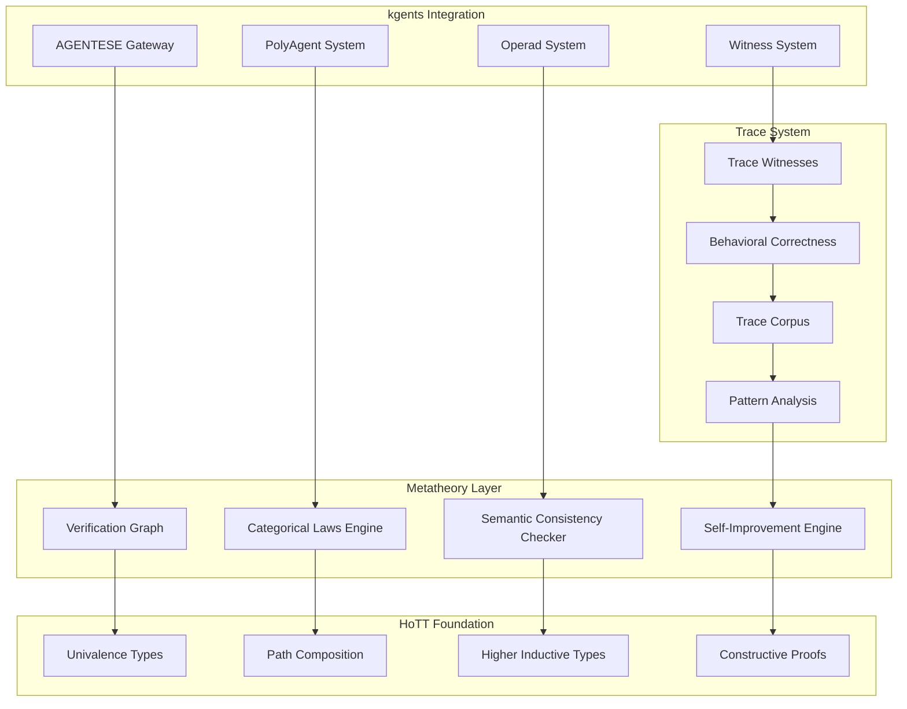

# Design Document: Formal Verification Metatheory

## Overview

The Formal Verification Metatheory system transforms kgents into a self-improving autopilot operating system through category-theoretic formal verification. Built on Homotopy Type Theory (HoTT) foundations, it provides graph-based specification analysis, behavioral correctness through trace witnesses, and continuous self-improvement capabilities for massive multi-agent orchestration.

The system operates as a reflective tower where each level can critique and improve the level below it, creating a generative loop from high-level principles to operational implementation and back.

## Architecture

### Core Components



### The Reflective Tower

```
Level ∞: Principles & Values (Joy, Ethics, Composition)
    ↓ [Derivation Functor]
Level 3: Meta-Meta-Spec (HoTT/Topos Theory)
    ↓ [Category Functor]
Level 2: Meta-Spec (Category Theory, AGENTESE)
    ↓ [Specification Functor]
Level 1: Spec (Requirements, Design, Tasks)
    ↓ [Implementation Functor]
Level 0: Code (Python, TypeScript, Agents)
    ↓ [Execution Functor]
Level -1: Traces (Runtime Behavior, Witnesses)
    ↓ [Synthesis Functor]
Level -2: Patterns (Emergent Behaviors)
    ↓ [Feedback Functor]
Level ∞: Refined Principles (Self-Improvement)
```

## Components and Interfaces

### 1. Verification Graph Engine

The core component that constructs and analyzes derivation graphs from principles to implementation.

```python
@dataclass(frozen=True)
class VerificationGraph:
    """Graph representing logical derivations from principles to implementation."""
    
    nodes: frozenset[GraphNode]
    edges: frozenset[DerivationEdge]
    principles: frozenset[Principle]
    implementations: frozenset[Implementation]
    
    def derive_path(self, principle: Principle, impl: Implementation) -> DerivationPath | None:
        """Find derivation path from principle to implementation."""
        
    def find_contradictions(self) -> list[ContradictionNode]:
        """Identify nodes where principles conflict."""
        
    def find_orphans(self) -> list[OrphanNode]:
        """Find implementations lacking principled derivation."""
        
    def suggest_connections(self, orphan: OrphanNode) -> list[SuggestedConnection]:
        """Suggest principled connections for orphaned implementations."""

@dataclass(frozen=True)
class GraphNode:
    """Node in the verification graph."""
    
    id: str
    level: int  # Position in reflective tower
    content: Any  # Principle, spec, implementation, etc.
    node_type: NodeType
    metadata: dict[str, Any]

class NodeType(Enum):
    PRINCIPLE = "principle"
    SPECIFICATION = "specification"
    IMPLEMENTATION = "implementation"
    TRACE = "trace"
    PATTERN = "pattern"

@dataclass(frozen=True)
class DerivationEdge:
    """Edge representing logical derivation between nodes."""
    
    source: str  # Node ID
    target: str  # Node ID
    derivation_type: DerivationType
    justification: str
    confidence: float  # 0.0 to 1.0
    
class DerivationType(Enum):
    LOGICAL_IMPLICATION = "logical_implication"
    CATEGORICAL_MORPHISM = "categorical_morphism"
    IMPLEMENTATION_REALIZES = "implementation_realizes"
    TRACE_WITNESSES = "trace_witnesses"
    PATTERN_SUGGESTS = "pattern_suggests"
```

### 2. Categorical Laws Engine

Verifies that agent compositions satisfy mathematical laws using HoTT foundations.

```python
class CategoricalLawsEngine:
    """Verifies categorical laws using HoTT foundations."""
    
    def __init__(self, hott_context: HoTTContext):
        self.hott = hott_context
        
    async def verify_composition_associativity(
        self, 
        f: AgentMorphism, 
        g: AgentMorphism, 
        h: AgentMorphism
    ) -> VerificationResult:
        """Verify (f ∘ g) ∘ h ≡ f ∘ (g ∘ h) using path equality."""
        
        left_composition = await self._compose(await self._compose(f, g), h)
        right_composition = await self._compose(f, await self._compose(g, h))
        
        # In HoTT, equality is a path type
        path_proof = await self.hott.construct_path(left_composition, right_composition)
        
        if path_proof:
            return VerificationResult.success(
                law="composition_associativity",
                proof=path_proof,
                witness=CompositionWitness(f, g, h, path_proof)
            )
        else:
            counter_example = await self._generate_counter_example(f, g, h)
            return VerificationResult.failure(
                law="composition_associativity",
                counter_example=counter_example,
                suggestion=await self._suggest_fix(f, g, h, counter_example)
            )
    
    async def verify_identity_laws(self, f: AgentMorphism) -> VerificationResult:
        """Verify f ∘ id ≡ f and id ∘ f ≡ f."""
        
    async def verify_functor_laws(self, F: AgentFunctor) -> VerificationResult:
        """Verify functor preserves composition and identity."""
        
    async def verify_operad_coherence(self, operad: Operad) -> VerificationResult:
        """Verify operad coherence conditions."""
        
    async def verify_sheaf_gluing(self, sheaf: SheafTool) -> VerificationResult:
        """Verify sheaf satisfies gluing conditions."""

@dataclass(frozen=True)
class VerificationResult:
    """Result of categorical law verification."""
    
    success: bool
    law: str
    proof: HoTTProof | None = None
    witness: TraceWitness | None = None
    counter_example: CounterExample | None = None
    suggestion: str | None = None
    
    @classmethod
    def success(cls, law: str, proof: HoTTProof, witness: TraceWitness) -> "VerificationResult":
        return cls(True, law, proof, witness, None, None)
    
    @classmethod
    def failure(cls, law: str, counter_example: CounterExample, suggestion: str) -> "VerificationResult":
        return cls(False, law, None, None, counter_example, suggestion)
```

### 3. HoTT Foundation Layer

Provides the mathematical foundation using Homotopy Type Theory principles.

```python
class HoTTContext:
    """Homotopy Type Theory context for formal verification."""
    
    def __init__(self):
        self.universe_levels: dict[str, int] = {}
        self.type_definitions: dict[str, HoTTType] = {}
        self.path_cache: dict[tuple[Any, Any], HoTTPath | None] = {}
    
    async def construct_path(self, a: Any, b: Any) -> HoTTPath | None:
        """Construct a path (proof of equality) between a and b."""
        
        # Check cache first
        cache_key = (id(a), id(b))
        if cache_key in self.path_cache:
            return self.path_cache[cache_key]
        
        # Try univalence: if a ≅ b, then a ≡ b
        if await self._are_isomorphic(a, b):
            path = await self._univalence_path(a, b)
            self.path_cache[cache_key] = path
            return path
        
        # Try path induction
        path = await self._path_induction(a, b)
        self.path_cache[cache_key] = path
        return path
    
    async def _are_isomorphic(self, a: Any, b: Any) -> bool:
        """Check if a and b are isomorphic (equivalent up to structure)."""
        
    async def _univalence_path(self, a: Any, b: Any) -> HoTTPath:
        """Construct path using univalence axiom: isomorphic = identical."""
        
    async def _path_induction(self, a: Any, b: Any) -> HoTTPath | None:
        """Try to construct path using path induction principle."""

@dataclass(frozen=True)
class HoTTType:
    """A type in HoTT with homotopy structure."""
    
    name: str
    universe_level: int
    constructors: frozenset[str]
    eliminators: frozenset[str]
    computation_rules: frozenset[str]
    
@dataclass(frozen=True)
class HoTTPath:
    """A path (proof of equality) in HoTT."""
    
    source: Any
    target: Any
    path_data: Any  # The actual proof term
    path_type: str  # "refl", "univalence", "induction", etc.
```

### 4. Trace Witness System

Captures runtime behavior as constructive proofs of specification compliance.

```python
class TraceWitnessSystem:
    """Captures and verifies trace witnesses as constructive proofs."""
    
    def __init__(self, hott_context: HoTTContext):
        self.hott = hott_context
        self.trace_corpus: TraceCorpus = TraceCorpus()
        
    async def capture_witness(
        self, 
        agent_path: str, 
        input_data: Any, 
        output_data: Any,
        execution_trace: ExecutionTrace
    ) -> TraceWitness:
        """Capture a trace witness as constructive proof."""
        
        witness = TraceWitness(
            agent_path=agent_path,
            input_data=input_data,
            output_data=output_data,
            trace=execution_trace,
            timestamp=datetime.utcnow(),
            proof_term=await self._construct_proof_term(execution_trace)
        )
        
        await self.trace_corpus.add_witness(witness)
        return witness
    
    async def verify_witness(
        self, 
        witness: TraceWitness, 
        specification: Specification
    ) -> WitnessVerification:
        """Verify that witness satisfies specification."""
        
        # Check if trace satisfies spec properties
        for property in specification.properties:
            if not await self._check_property(witness, property):
                return WitnessVerification.failure(
                    witness=witness,
                    violated_property=property,
                    counter_example=await self._extract_counter_example(witness, property)
                )
        
        return WitnessVerification.success(witness, specification)
    
    async def synthesize_patterns(self) -> list[BehaviorPattern]:
        """Analyze trace corpus to identify behavioral patterns."""
        
        patterns = []
        
        # Group traces by agent path
        grouped_traces = self.trace_corpus.group_by_path()
        
        for path, traces in grouped_traces.items():
            # Look for invariants
            invariants = await self._find_invariants(traces)
            
            # Look for composition patterns
            compositions = await self._find_composition_patterns(traces)
            
            # Look for temporal patterns
            temporal = await self._find_temporal_patterns(traces)
            
            patterns.extend([
                BehaviorPattern("invariant", path, invariants),
                BehaviorPattern("composition", path, compositions),
                BehaviorPattern("temporal", path, temporal)
            ])
        
        return patterns

@dataclass(frozen=True)
class TraceWitness:
    """A trace witness as constructive proof of behavior."""
    
    agent_path: str
    input_data: Any
    output_data: Any
    trace: ExecutionTrace
    timestamp: datetime
    proof_term: HoTTProof  # The constructive proof
    
    def verify_against_spec(self, spec: Specification) -> bool:
        """Verify this witness satisfies the specification."""
        
@dataclass(frozen=True)
class BehaviorPattern:
    """Discovered pattern in trace corpus."""
    
    pattern_type: str  # "invariant", "composition", "temporal"
    agent_path: str
    pattern_data: Any
    confidence: float
    supporting_traces: list[TraceWitness]
```

### 5. Self-Improvement Engine

Analyzes patterns and proposes specification improvements.

```python
class SelfImprovementEngine:
    """Analyzes patterns and proposes specification improvements."""
    
    def __init__(
        self, 
        verification_graph: VerificationGraph,
        trace_system: TraceWitnessSystem,
        categorical_engine: CategoricalLawsEngine
    ):
        self.graph = verification_graph
        self.traces = trace_system
        self.categorical = categorical_engine
        
    async def analyze_improvement_opportunities(self) -> list[ImprovementProposal]:
        """Analyze system for improvement opportunities."""
        
        proposals = []
        
        # Find specification gaps
        gaps = await self._find_specification_gaps()
        proposals.extend(await self._propose_gap_fixes(gaps))
        
        # Find inefficient patterns
        inefficiencies = await self._find_inefficient_patterns()
        proposals.extend(await self._propose_efficiency_improvements(inefficiencies))
        
        # Find categorical law violations
        violations = await self._find_categorical_violations()
        proposals.extend(await self._propose_law_fixes(violations))
        
        # Find emergent behaviors that should be formalized
        emergent = await self._find_emergent_behaviors()
        proposals.extend(await self._propose_emergent_formalizations(emergent))
        
        return proposals
    
    async def validate_proposal(self, proposal: ImprovementProposal) -> ValidationResult:
        """Validate that a proposal maintains correctness."""
        
        # Create hypothetical system with proposal applied
        hypothetical_graph = await self._apply_proposal(self.graph, proposal)
        
        # Verify categorical laws still hold
        law_results = await self.categorical.verify_all_laws(hypothetical_graph)
        
        # Verify no new contradictions introduced
        contradictions = hypothetical_graph.find_contradictions()
        
        # Estimate impact on existing traces
        trace_impact = await self._estimate_trace_impact(proposal)
        
        if law_results.all_pass() and not contradictions and trace_impact.acceptable():
            return ValidationResult.approved(proposal, law_results, trace_impact)
        else:
            return ValidationResult.rejected(proposal, law_results, contradictions, trace_impact)
    
    async def apply_improvement(self, proposal: ImprovementProposal) -> ApplicationResult:
        """Apply validated improvement to the system."""
        
        # Update specifications
        spec_updates = await self._generate_spec_updates(proposal)
        
        # Update implementations if needed
        impl_updates = await self._generate_impl_updates(proposal)
        
        # Update verification graph
        graph_updates = await self._update_verification_graph(proposal)
        
        return ApplicationResult(spec_updates, impl_updates, graph_updates)

@dataclass(frozen=True)
class ImprovementProposal:
    """Proposal for system improvement."""
    
    proposal_id: str
    proposal_type: str  # "gap_fix", "efficiency", "law_fix", "emergent"
    description: str
    justification: str
    estimated_impact: float
    risk_level: str  # "low", "medium", "high"
    spec_changes: list[SpecChange]
    impl_changes: list[ImplChange]
    
@dataclass(frozen=True)
class ValidationResult:
    """Result of validating an improvement proposal."""
    
    approved: bool
    proposal: ImprovementProposal
    law_verification: CategoricalVerificationResult
    contradictions: list[ContradictionNode]
    trace_impact: TraceImpactAnalysis
    
    @classmethod
    def approved(
        cls, 
        proposal: ImprovementProposal, 
        laws: CategoricalVerificationResult, 
        impact: TraceImpactAnalysis
    ) -> "ValidationResult":
        return cls(True, proposal, laws, [], impact)
    
    @classmethod
    def rejected(
        cls, 
        proposal: ImprovementProposal, 
        laws: CategoricalVerificationResult, 
        contradictions: list[ContradictionNode],
        impact: TraceImpactAnalysis
    ) -> "ValidationResult":
        return cls(False, proposal, laws, contradictions, impact)
```

## Data Models

### Core Data Structures

```python
@dataclass(frozen=True)
class Specification:
    """A formal specification with properties and constraints."""
    
    spec_id: str
    name: str
    version: str
    properties: frozenset[SpecProperty]
    constraints: frozenset[SpecConstraint]
    derivation_source: str | None  # Which principle this derives from
    
@dataclass(frozen=True)
class SpecProperty:
    """A property that must hold for the specification."""
    
    property_id: str
    property_type: str  # "invariant", "safety", "liveness", "composition"
    formal_statement: str  # In HoTT notation
    natural_language: str  # Human-readable description
    test_strategy: str  # How to test this property
    
@dataclass(frozen=True)
class Principle:
    """A high-level principle that guides system design."""
    
    principle_id: str
    name: str
    statement: str
    category: str  # "ethical", "aesthetic", "mathematical", "practical"
    priority: int  # 1-7 matching kgents principles
    
@dataclass(frozen=True)
class ExecutionTrace:
    """Detailed trace of agent execution."""
    
    trace_id: str
    agent_path: str
    start_time: datetime
    end_time: datetime
    input_data: Any
    output_data: Any
    intermediate_steps: list[ExecutionStep]
    resource_usage: ResourceUsage
    
@dataclass(frozen=True)
class ExecutionStep:
    """Single step in agent execution."""
    
    step_id: str
    timestamp: datetime
    operation: str
    input_state: Any
    output_state: Any
    side_effects: list[SideEffect]
```

## Correctness Properties

*A property is a characteristic or behavior that should hold true across all valid executions of a system—essentially, a formal statement about what the system should do. Properties serve as the bridge between human-readable specifications and machine-verifiable correctness guarantees.*

Now I'll use the prework tool to analyze the acceptance criteria for testability:

<function_calls>
<invoke name="prework">
<parameter name="featureName">formal-verification-metatheory

Based on the prework analysis, I'll now convert the acceptance criteria into testable properties:

### Property Reflection

After reviewing all properties identified in the prework, I found several areas where properties can be consolidated:

- **Graph construction properties** (1.1-1.4) can be unified into comprehensive graph correctness
- **Categorical law properties** (2.1-2.6) form a coherent mathematical verification suite
- **Trace witness properties** (3.1-3.5) create a complete behavioral correctness framework
- **Self-improvement properties** (5.1-5.5) form an integrated evolution system
- **HoTT foundation properties** (10.1-10.5) provide the mathematical foundation

### Correctness Properties

**Property 1: Graph Derivation Completeness**
*For any* specification with principled derivations, the verification graph should contain a valid path from each principle to its corresponding implementation
**Validates: Requirements 1.1, 1.3**

**Property 2: Contradiction Detection Soundness**
*For any* set of principles that logically conflict, the system should identify all contradiction nodes and provide resolution strategies
**Validates: Requirements 1.2**

**Property 3: Multi-Type Graph Support**
*For any* combination of agents, artifacts, narration, and operational data, the verification graph should correctly represent and analyze all data types
**Validates: Requirements 1.4**

**Property 4: Categorical Composition Associativity**
*For any* three agent morphisms f, g, h, the composition (f ∘ g) ∘ h should equal f ∘ (g ∘ h) under HoTT path equality
**Validates: Requirements 2.1**

**Property 5: Categorical Identity Laws**
*For any* agent morphism f and identity morphism id, both f ∘ id = f and id ∘ f = f should hold
**Validates: Requirements 2.2**

**Property 6: Functor Law Preservation**
*For any* agent functor F, it should preserve both composition (F(g ∘ f) = F(g) ∘ F(f)) and identity (F(id) = id)
**Validates: Requirements 2.3**

**Property 7: Operad Coherence Verification**
*For any* operad specification, all coherence conditions should be verified and any violations should generate counter-examples
**Validates: Requirements 2.4**

**Property 8: Sheaf Gluing Consistency**
*For any* sheaf tool, the local-to-global gluing properties should be verified with constructive proofs
**Validates: Requirements 2.5**

**Property 9: Counter-Example Generation**
*For any* categorical law violation, the system should generate concrete counter-examples with remediation suggestions
**Validates: Requirements 2.6**

**Property 10: Trace Witness Capture Completeness**
*For any* agent execution, a trace witness should be captured as a constructive proof of the behavior
**Validates: Requirements 3.1**

**Property 11: Trace Specification Compliance**
*For any* trace witness and corresponding specification, the trace should satisfy all specification properties or generate counter-examples
**Validates: Requirements 3.2, 3.3**

**Property 12: Trace Corpus Evolution**
*For any* accumulated trace corpus, behavioral patterns should be identified and specification improvements should be suggested
**Validates: Requirements 3.4, 3.5**

**Property 13: Semantic Consistency Across Documents**
*For any* set of specification documents referencing the same concepts, semantic consistency should be verified and conflicts identified
**Validates: Requirements 4.1, 4.2**

**Property 14: Specification Evolution Compatibility**
*For any* specification evolution, backward compatibility should be verified and breaking changes should be flagged
**Validates: Requirements 4.3**

**Property 15: Cross-Reference Analysis Completeness**
*For any* set of requirements, design, and implementation documents, cross-reference analysis should identify all connections and gaps
**Validates: Requirements 4.4, 4.5**

**Property 16: Self-Improvement Proposal Generation**
*For any* operational data accumulation, improvement patterns should be identified and formal proposals should be generated with justification
**Validates: Requirements 5.1, 5.2**

**Property 17: Improvement Categorical Compliance**
*For any* proposed specification change, categorical law compliance should be verified before application
**Validates: Requirements 5.3**

**Property 18: Automated Specification Evolution**
*For any* validated improvement, specifications should be automatically updated with proper versioning and A/B testing support
**Validates: Requirements 5.4, 5.5**

**Property 19: Continuous Society Verification**
*For any* deployed agent society, behavioral correctness should be continuously verified with automatic anomaly detection and correction
**Validates: Requirements 6.1, 6.2**

**Property 20: Dynamic Agent Integration**
*For any* new agent joining a society, compatibility should be verified and dynamic reconfiguration should maintain formal guarantees
**Validates: Requirements 6.3, 6.4**

**Property 21: Adaptive Orchestration Correctness**
*For any* system load change, orchestration strategies should adapt while preserving correctness guarantees
**Validates: Requirements 6.5**

**Property 22: kgents Integration Seamlessness**
*For any* AGENTESE path or PolyAgent composition, categorical properties should be automatically verified with native integration
**Validates: Requirements 7.2, 7.3, 7.5**

**Property 23: Sympathetic Error Communication**
*For any* verification error, the system should provide clear, sympathetic language with constructive suggestions and examples
**Validates: Requirements 8.2, 8.4**

**Property 24: Specification-Driven Agent Generation**
*For any* formal specification, agents should be derivable and implementations should be automatically regenerated when specifications change
**Validates: Requirements 9.1, 9.2**

**Property 25: Emergent Behavior Verification**
*For any* multi-agent system, emergent behaviors should be formally verifiable with provably correct composition at arbitrary scales
**Validates: Requirements 9.3, 9.4**

**Property 26: Evolutionary Path Automation**
*For any* system evolution need, evolutionary paths should be automatically proposed and verified
**Validates: Requirements 9.5**

**Property 27: HoTT Univalence Foundation**
*For any* two specifications that are equivalent up to isomorphism, they should be treated as identical under the univalence axiom
**Validates: Requirements 10.1**

**Property 28: Homotopy Type Representation**
*For any* agent type, it should be represented as a homotopy type with natural equivalence structure
**Validates: Requirements 10.2**

**Property 29: HoTT Path Composition**
*For any* composition law verification, HoTT path composition should be used with higher inductive types for agent structure definitions
**Validates: Requirements 10.3, 10.4**

**Property 30: Constructive Proof Generation**
*For any* generated proof, it should be constructive and also serve as a program (witness)
**Validates: Requirements 10.5**

## Error Handling

The system employs a sympathetic error model that treats failures as learning opportunities:

### Error Categories

```python
class VerificationErrorCategory(Enum):
    CATEGORICAL_LAW_VIOLATION = "categorical_law_violation"
    SEMANTIC_INCONSISTENCY = "semantic_inconsistency"
    DERIVATION_GAP = "derivation_gap"
    TRACE_SPECIFICATION_MISMATCH = "trace_specification_mismatch"
    IMPROVEMENT_VALIDATION_FAILURE = "improvement_validation_failure"
    HOTT_TYPE_ERROR = "hott_type_error"

@dataclass(frozen=True)
class VerificationError:
    """Sympathetic error with learning opportunities."""
    
    category: VerificationErrorCategory
    message: str
    context: dict[str, Any]
    
    # Learning opportunities
    counter_example: Any | None
    suggested_fix: str | None
    educational_content: str | None
    
    # Recovery
    retry_strategy: str | None
    fallback_approach: str | None
```

### Sympathetic Error Messages

Instead of technical jargon, the system provides warm, educational feedback:

- **Categorical Law Violation**: "It looks like these agents don't compose quite right. Let me show you what's happening and suggest a fix."
- **Semantic Inconsistency**: "I found some concepts that mean different things in different places. Here's how we can align them."
- **Derivation Gap**: "This implementation seems to be floating without principled foundation. Let me suggest some connections."

## Testing Strategy

### Dual Testing Approach

The system uses both unit tests and property-based tests:

**Unit Tests**: Focus on specific examples, edge cases, and integration points
- HoTT path construction examples
- Graph visualization generation
- kgents integration points
- Error message formatting

**Property-Based Tests**: Verify universal properties across all inputs
- All 30 correctness properties listed above
- Categorical law verification across random agent compositions
- Trace witness generation for arbitrary executions
- Self-improvement proposal validation

### Property-Based Testing Configuration

Using Hypothesis for Python property-based testing:
- Minimum 100 iterations per property test
- Each test tagged with: **Feature: formal-verification-metatheory, Property N: [property text]**
- Custom generators for:
  - Agent morphisms and compositions
  - HoTT types and paths
  - Specification documents
  - Trace witnesses
  - Behavioral patterns

### Testing Infrastructure

```python
# Example property test
@given(
    f=agent_morphism_strategy(),
    g=agent_morphism_strategy(), 
    h=agent_morphism_strategy()
)
def test_composition_associativity(f, g, h):
    """
    Feature: formal-verification-metatheory
    Property 4: Categorical Composition Associativity
    """
    engine = CategoricalLawsEngine(HoTTContext())
    
    result = await engine.verify_composition_associativity(f, g, h)
    
    assert result.success, f"Composition associativity failed: {result.counter_example}"
    assert result.proof is not None
    assert result.witness is not None
```

## Implementation Notes

### Integration with Existing kgents Infrastructure

The system integrates deeply with existing kgents components:

1. **AGENTESE Protocol**: Automatic verification of path definitions and aspect categories
2. **PolyAgent System**: Verification of polynomial coherence and state transitions  
3. **Witness System**: Enhanced with constructive proof capabilities
4. **Operad System**: Formal verification of composition grammar
5. **SheafTool System**: Verification of local-to-global coherence

### Configuration Structure

```
~/.kgents/
├── verification/
│   ├── config.yaml              # Verification engine configuration
│   ├── principles.yaml          # System principles and priorities
│   ├── hott_context.json        # HoTT type definitions and universe levels
│   └── trace_corpus/            # Accumulated trace witnesses
├── graphs/
│   ├── current_graph.json       # Current verification graph
│   ├── graph_history/           # Historical graph states
│   └── visualizations/          # Generated graph visualizations
└── improvements/
    ├── proposals/               # Generated improvement proposals
    ├── validated/               # Validated improvements ready for application
    └── applied/                 # Applied improvements with results
```

### Performance Considerations

- **Graph Analysis**: Incremental updates rather than full reconstruction
- **HoTT Path Construction**: Caching of computed paths and isomorphisms
- **Trace Corpus**: Efficient indexing and pattern matching
- **Property Verification**: Parallel execution of independent verifications

The system is designed to be both mathematically rigorous and practically delightful, transforming formal verification from an academic exercise into a joyful part of the development process.

---

*"The noun is a lie. There is only the rate of change. And the most profound change is the rate at which we can verify and improve our own understanding."*