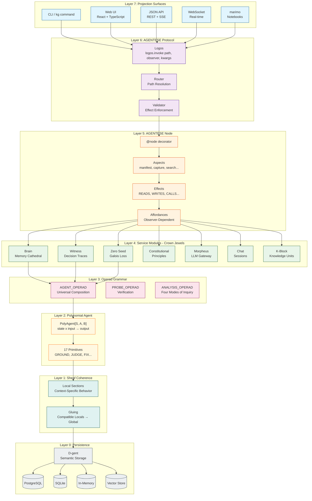
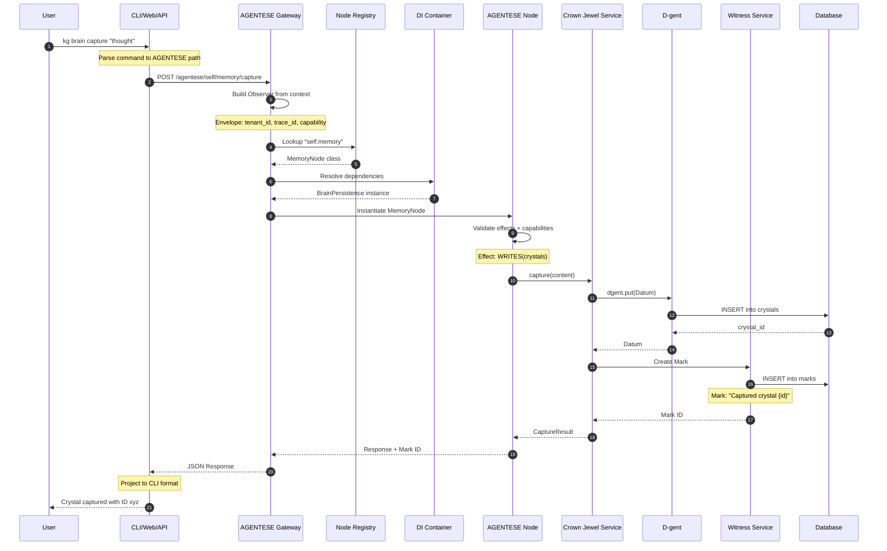
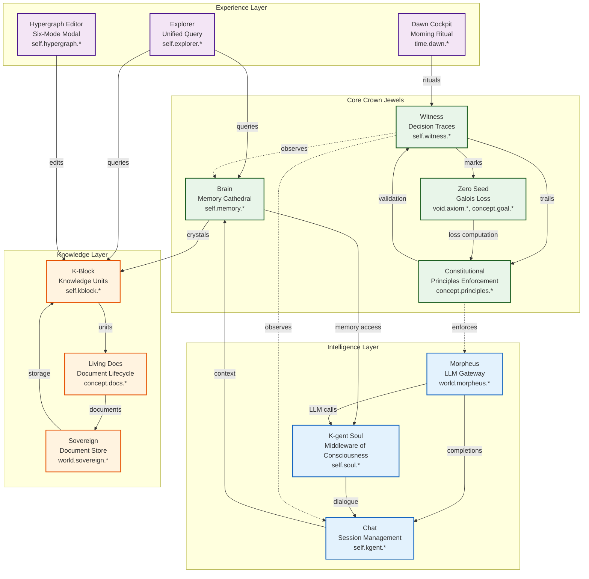
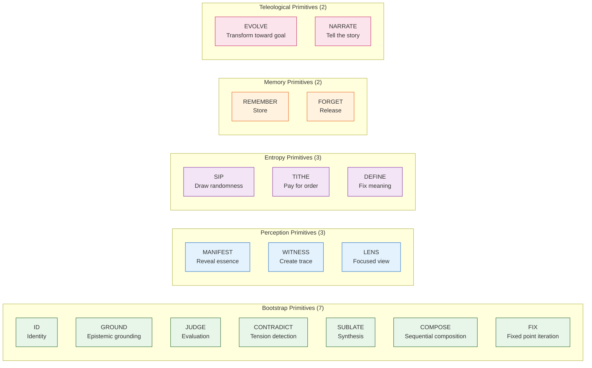
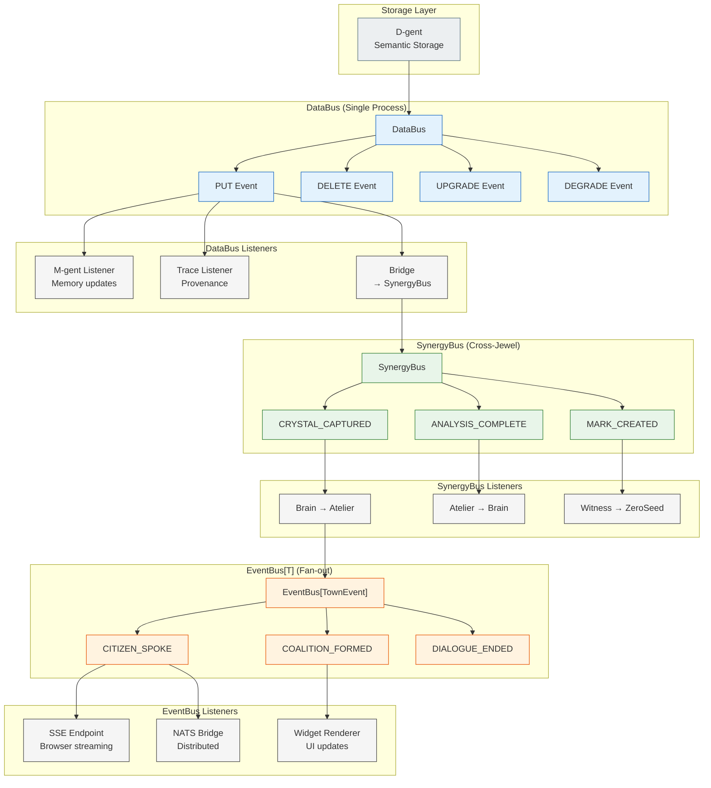
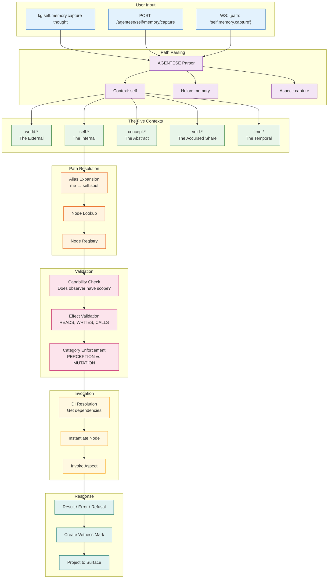

# kgents Architecture

> *"Every agent is a fullstack agent. The more fully defined, the more fully projected."*

This document provides visual architecture diagrams for the kgents system using the Metaphysical Fullstack pattern.

---

## Table of Contents

1. [Main System Architecture](#1-main-system-architecture)
2. [The 7-Layer Stack](#2-the-7-layer-stack)
3. [Request Lifecycle](#3-request-lifecycle)
4. [Crown Jewels Ecosystem](#4-crown-jewels-ecosystem)
5. [Categorical Foundation](#5-categorical-foundation)
6. [Event-Driven Architecture](#6-event-driven-architecture)
7. [AGENTESE Path Resolution](#7-agentese-path-resolution)

---

## 1. Main System Architecture

The complete kgents system showing all major subsystems and their relationships.



---

## 2. The 7-Layer Stack

A detailed view of each layer in the Metaphysical Fullstack pattern.

```mermaid
graph LR
    subgraph L7["7. Projection Surfaces"]
        direction TB
        L7a[CLI]
        L7b[TUI]
        L7c[Web]
        L7d[marimo]
        L7e[JSON]
        L7f[SSE]
    end

    subgraph L6["6. AGENTESE Protocol"]
        direction TB
        L6a["logos.invoke(path, observer, **kwargs)"]
        L6b[Envelope: tenant, trace, capability]
    end

    subgraph L5["5. AGENTESE Node"]
        direction TB
        L5a["@node decorator"]
        L5b[Aspects: verbs]
        L5c[Effects: side-effects]
        L5d[Affordances: what observer can do]
    end

    subgraph L4["4. Service Module"]
        direction TB
        L4a["services/name/"]
        L4b[Crown Jewel Logic]
        L4c[Persistence Adapter]
        L4d[Frontend Components]
    end

    subgraph L3["3. Operad Grammar"]
        direction TB
        L3a[Composition Laws]
        L3b[Valid Operations]
        L3c[Associativity]
    end

    subgraph L2["2. Polynomial Agent"]
        direction TB
        L2a["PolyAgent[S, A, B]"]
        L2b["state x input → output"]
        L2c[Mode-Dependent Behavior]
    end

    subgraph L1["1. Sheaf Coherence"]
        direction TB
        L1a[Local Views]
        L1b[Gluing Condition]
        L1c[Global Consistency]
    end

    subgraph L0["0. Persistence Layer"]
        direction TB
        L0a[StorageProvider]
        L0b[membrane.db]
        L0c[vectors]
        L0d[blobs]
    end

    L7 --> L6
    L6 --> L5
    L5 --> L4
    L4 --> L3
    L3 --> L2
    L2 --> L1
    L1 --> L0

    classDef layer7 fill:#e3f2fd,stroke:#1565c0
    classDef layer6 fill:#f3e5f5,stroke:#7b1fa2
    classDef layer5 fill:#fff3e0,stroke:#ef6c00
    classDef layer4 fill:#e8f5e9,stroke:#2e7d32
    classDef layer3 fill:#fce4ec,stroke:#c2185b
    classDef layer2 fill:#fff8e1,stroke:#f9a825
    classDef layer1 fill:#e0f2f1,stroke:#00695c
    classDef layer0 fill:#eceff1,stroke:#546e7a

    class L7,L7a,L7b,L7c,L7d,L7e,L7f layer7
    class L6,L6a,L6b layer6
    class L5,L5a,L5b,L5c,L5d layer5
    class L4,L4a,L4b,L4c,L4d layer4
    class L3,L3a,L3b,L3c layer3
    class L2,L2a,L2b,L2c layer2
    class L1,L1a,L1b,L1c layer1
    class L0,L0a,L0b,L0c,L0d layer0
```



---

## 3. Request Lifecycle

How a request flows through the kgents system from user input to response.



---

## 4. Crown Jewels Ecosystem

The major services (Crown Jewels) and how they interact.



---

## 5. Categorical Foundation

The three-layer categorical pattern that all kgents domains instantiate.

```mermaid
graph TB
    subgraph Pattern["The Unified Categorical Pattern"]
        direction TB
        P1["PolyAgent<br/>State machine with mode-dependent inputs"]
        P2["Operad<br/>Composition grammar with laws"]
        P3["Sheaf<br/>Global coherence from local views"]
    end

    subgraph Town["Agent Town Instantiation"]
        T1["CitizenPolynomial<br/>IDLE → SPEAKING → REFLECTING"]
        T2["TOWN_OPERAD<br/>greet >> converse >> remember"]
        T3["TownSheaf<br/>Citizens + Environment = Emergence"]
    end

    subgraph Soul["K-gent Soul Instantiation"]
        S1["SOUL_POLYNOMIAL<br/>DORMANT → AWAKE → REFLECTING"]
        S2["SOUL_OPERAD<br/>sense >> challenge >> reflect"]
        S3["SOUL_SHEAF<br/>Aesthetic + Categorical + Joy = Kent"]
    end

    subgraph Design["Design System Instantiation"]
        D1["DesignPolynomial<br/>DRAFT → REVIEW → FINALIZED"]
        D2["DESIGN_OPERAD<br/>sketch >> refine >> crystallize"]
        D3["DesignSheaf<br/>Local styles = Global coherence"]
    end

    P1 -->|instance| T1
    P1 -->|instance| S1
    P1 -->|instance| D1

    P2 -->|instance| T2
    P2 -->|instance| S2
    P2 -->|instance| D2

    P3 -->|instance| T3
    P3 -->|instance| S3
    P3 -->|instance| D3

    classDef pattern fill:#fff8e1,stroke:#f57f17,stroke-width:3px
    classDef town fill:#e8f5e9,stroke:#2e7d32
    classDef soul fill:#e3f2fd,stroke:#1565c0
    classDef design fill:#fce4ec,stroke:#c2185b

    class P1,P2,P3 pattern
    class T1,T2,T3 town
    class S1,S2,S3 soul
    class D1,D2,D3 design
```



### The 17 Polynomial Primitives



---

## 6. Event-Driven Architecture

The three-bus event architecture for reactive data flow.



### Event Flow Summary

| Bus | Scope | Delivery | Use Case |
|-----|-------|----------|----------|
| **DataBus** | Single process | At-least-once, causal ordering | D-gent storage events |
| **SynergyBus** | Cross-jewel | Fire-and-forget, handler isolation | Crown Jewel coordination |
| **EventBus** | Fan-out | Backpressure, bounded queues | UI/streaming distribution |

---

## 7. AGENTESE Path Resolution

How AGENTESE paths are parsed, resolved, and invoked.



### AGENTESE Path Grammar

```
Path     := Context "." Holon "." Aspect
Context  := "world" | "self" | "concept" | "void" | "time"
Holon    := Identifier ("." Identifier)*
Aspect   := Identifier

Examples:
  self.memory.capture     → Brain capture
  world.morpheus.complete → LLM completion
  void.entropy.sip        → Draw randomness
  time.dawn.ritual        → Morning routine
  concept.principles.validate → Constitutional check
```

---

## Directory Structure

```
impl/claude/
├── agents/               # Categorical primitives (infrastructure)
│   ├── poly/             # PolyAgent[S, A, B] - polynomial functors
│   ├── operad/           # Composition grammar and laws
│   ├── sheaf/            # Global coherence from local views
│   ├── flux/             # Stream processing (discrete → continuous)
│   ├── d/                # D-gent (generic persistence)
│   ├── k/                # K-gent (soul, dialogue, governance)
│   └── ...               # Other algebraic agents (a-z taxonomy)
│
├── services/             # Crown Jewels (consumers of agents/)
│   ├── brain/            # Memory cathedral
│   ├── witness/          # Decision traces
│   ├── zero_seed/        # Galois loss computation
│   ├── constitutional/   # Principles enforcement
│   ├── morpheus/         # LLM gateway
│   ├── chat/             # Session management
│   ├── k_block/          # Knowledge units
│   └── ...               # 50+ services
│
├── protocols/            # Infrastructure protocols
│   ├── agentese/         # AGENTESE universal protocol
│   │   ├── gateway.py    # HTTP/WS router
│   │   ├── registry.py   # Node registration
│   │   ├── logos.py      # Path resolution
│   │   └── contexts/     # Node implementations
│   ├── api/              # FastAPI app
│   └── cli/              # CLI projection
│
├── models/               # SQLAlchemy models (generic)
└── web/                  # Container functor (React frontend)
```

---

## Key Insights

### 1. The Protocol IS the API

```python
# All transports collapse to the same invocation:
await logos.invoke("self.memory.capture", observer, content="thought")

# CLI:       kg brain capture "thought"
# HTTP:      POST /agentese/self/memory/capture
# WebSocket: {"path": "self.memory.capture", ...}
# gRPC:      Same pattern
```

### 2. Observer-Dependent Affordances

```python
# Same path, different observers, different results:
await logos("world.house.manifest", architect)  # → Blueprint
await logos("world.house.manifest", poet)       # → Metaphor
await logos("world.house.manifest", economist)  # → Appraisal
```

### 3. Categorical Universality

Understanding one domain teaches you the others:

| Layer | Purpose | Examples |
|-------|---------|----------|
| **PolyAgent** | State machine with mode-dependent inputs | CitizenPolynomial, SOUL_POLYNOMIAL |
| **Operad** | Composition grammar with laws | TOWN_OPERAD, DESIGN_OPERAD |
| **Sheaf** | Global coherence from local views | TownSheaf, ProjectSheaf |

### 4. Services Own Their Adapters

```python
# Services know their domain semantics
class BrainPersistence:
    def __init__(self, table_adapter: TableAdapter, dgent: DgentProtocol):
        self.table = table_adapter  # Queryable metadata
        self.dgent = dgent          # Semantic content

    async def capture(self, content: str) -> CaptureResult:
        # Dual-track storage with service awareness
        datum = await self.dgent.put(Datum(...))
        crystal = Crystal(datum_id=datum.id, ...)
        await self.table.put(crystal)
```

---

## Related Documentation

- `CLAUDE.md` - Project instructions and philosophy
- `spec/protocols/agentese.md` - AGENTESE specification
- `docs/skills/metaphysical-fullstack.md` - Fullstack pattern skill
- `docs/skills/agentese-node-registration.md` - Node registration skill
- `docs/skills/data-bus-integration.md` - Event bus skill
- `docs/systems-reference.md` - Complete systems inventory

---

*"Every agent is a fullstack agent. The more fully defined, the more fully projected."*
