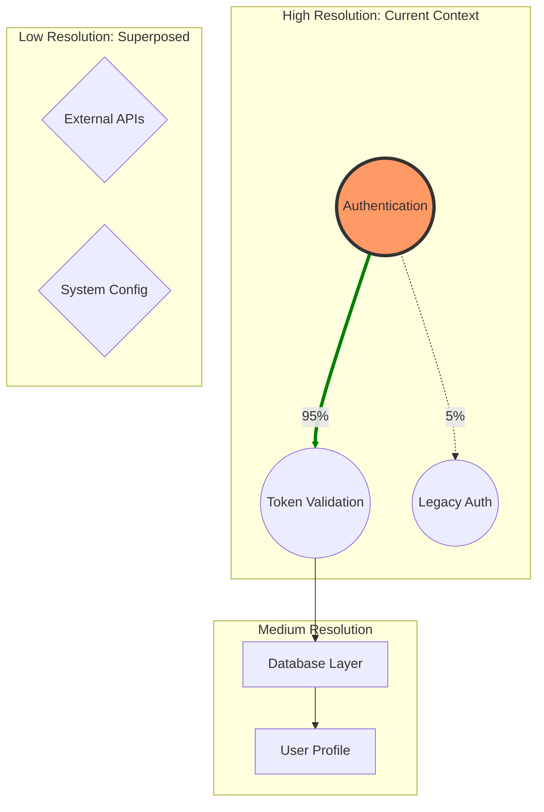

# M-gent Enhancement Plan: Holographic Cartography

> From Memory-as-Retrieval to Memory-as-Orientation

## Executive Summary

This plan evolves M-gents from "What do I know about X?" to "Where is X in relation to Y, and how do I get there?" by introducing **Holographic Cartography**—the ability to generate fuzzy, isomorphic maps of semantic space for navigation, debugging, and optimal context injection.

**The Core Question**: What is the most perfect context injection that can be given to an agent for any given turn?

**The Answer**: Not a search result—a *map* that shows position, adjacency, and horizon.

---

## Part I: Synergy Analysis

### Critical Synergies Identified

| Agent | Synergy Type | Value to Cartography |
|-------|--------------|---------------------|
| **N-gent** | **CRITICAL** | Desire Lines come from SemanticTrace history |
| **L-gent** | **CRITICAL** | Embedding space is the terrain being mapped |
| **O-gent** | HIGH | Three-dimensional observability (X,Y,Z) provides cartographic metadata |
| **Ψ-gent** | HIGH | Both do projection; Cartographer projects space, Ψ-gent projects problems |
| **B-gent** | MEDIUM | Token budget constrains map resolution (foveation economics) |

### N-gent Integration: The Source of Desire Lines

N-gent's `SemanticTrace` is the crystal record of agent behavior. Desire Lines are derived from trace history:

```python
# N-gent provides the stones; Cartographer reveals the paths worn between them
class DesireLineComputer:
    """
    Analyzes N-gent SemanticTraces to find actual navigation patterns.
    """
    historian: Historian  # N-gent's recorder

    async def compute_desire_lines(
        self,
        landmarks: list[Attractor],
        lookback: int = 1000
    ) -> list[WeightedEdge]:
        # Get recent trace history
        traces = await self.historian.get_recent(lookback)

        # Count transitions between landmarks
        transitions: Counter[tuple[str, str]] = Counter()
        for i in range(len(traces) - 1):
            from_landmark = self.nearest_landmark(traces[i], landmarks)
            to_landmark = self.nearest_landmark(traces[i+1], landmarks)
            if from_landmark != to_landmark:
                transitions[(from_landmark.id, to_landmark.id)] += 1

        # Convert to weighted edges
        return [
            WeightedEdge(
                source=from_id,
                target=to_id,
                weight=count / sum(transitions.values()),
                trace_ids=[...]  # For provenance
            )
            for (from_id, to_id), count in transitions.items()
        ]
```

**The Insight**: Urban planners look at grass to find desire lines. We look at N-gent traces.

### L-gent Integration: The Terrain

L-gent provides the semantic embedding space. The Cartographer is L-gent's visualization layer:

```python
# L-gent's three brains become the map's coordinate systems
class CartographicTerrain:
    """
    L-gent's space as navigable terrain.
    """
    librarian: Librarian  # L-gent's catalog

    async def find_attractors(
        self,
        context: ContextVector,
        radius: float = 0.8
    ) -> list[Attractor]:
        # Use L-gent's semantic search to find dense clusters
        nearby = await self.librarian.find(
            embedding=context.embedding,
            threshold=radius,
            limit=100
        )

        # Cluster into Attractors (landmarks)
        return self.cluster_to_attractors(nearby)

    async def compute_semantic_distance(
        self,
        from_concept: Concept,
        to_concept: Concept
    ) -> float:
        # L-gent provides the metric
        return 1.0 - await self.librarian.similarity(
            from_concept.embedding,
            to_concept.embedding
        )
```

### O-gent Integration: Map Health Metrics

O-gent's three dimensions provide cartographic metadata:

| O-gent Dimension | Cartographic Meaning |
|------------------|---------------------|
| X (Telemetric) | Path latencies, throughput |
| Y (Semantic) | Drift detection shows "shifting terrain" |
| Z (Axiological) | Value density, cost-to-traverse |

```python
class CartographicObserver:
    """
    O-gent observes the map's health.
    """
    async def annotate_map(self, holo_map: HoloMap) -> HoloMap:
        # Add telemetric annotations
        for edge in holo_map.desire_lines:
            edge.latency_p95 = await self.get_edge_latency(edge)
            edge.error_rate = await self.get_edge_errors(edge)

        # Add semantic health (drift detection on paths)
        for node in holo_map.landmarks:
            node.semantic_drift = await self.measure_drift(node)

        # Add economic cost (B-gent integration via O-gent)
        holo_map.traverse_cost = await self.estimate_traverse_cost(holo_map)

        return holo_map
```

### Ψ-gent Integration: Dual Projection

Both agents do projection, but in orthogonal directions:

| Aspect | M-gent Cartographer | Ψ-gent |
|--------|---------------------|--------|
| Projects | **Space** (high-dim → map) | **Problems** (novel → familiar) |
| Output | Topology | Solution |
| Purpose | Navigation | Understanding |

**Synergy**: The Cartographer can show "Here are the metaphors near your current problem":

```python
class MetaphorLocator:
    """
    Use the HoloMap to locate relevant Ψ-gent metaphors.
    """
    async def find_metaphor_neighborhood(
        self,
        problem: Problem,
        holo_map: HoloMap
    ) -> list[Metaphor]:
        # Locate problem on map
        position = await self.cartographer.locate(problem.embedding)

        # Find metaphors near that position
        nearby_landmarks = holo_map.landmarks_within(position, radius=0.3)

        # Filter for metaphor-type artifacts
        return [
            landmark.artifact
            for landmark in nearby_landmarks
            if landmark.artifact_type == "metaphor"
        ]
```

---

## Part II: Specification Additions

### 1. New Primitive: `CartographerAgent`

**Add to**: `spec/m-gents/primitives.md`

```python
CartographerAgent: (ContextVector, Resolution) → HoloMap

class CartographerAgent(Agent[ContextVector, HoloMap]):
    """
    Projects the high-dimensional memory space into a navigable,
    fuzzy topology.

    It answers: "Where am I?", "What is adjacent?", "Where are the cliffs?"

    CRITICAL INTEGRATIONS:
    - L-gent: Provides the embedding space (the terrain)
    - N-gent: Provides SemanticTraces (the desire lines)
    - O-gent: Provides health annotations (telemetry on paths)
    - B-gent: Constrains resolution via token budget
    """
    memory: HolographicMemory       # M-gent storage
    librarian: Librarian            # L-gent for semantic space
    historian: Historian            # N-gent for trace history

    async def invoke(
        self,
        context: ContextVector,
        resolution: Resolution = Resolution.ADAPTIVE
    ) -> HoloMap:
        # 1. IDENTIFY LANDMARKS (high-density memory clusters)
        #    Uses L-gent similarity search
        landmarks = await self.find_attractors(context, radius=0.8)

        # 2. TRACE DESIRE LINES (historical paths from N-gent)
        desire_lines = await self.compute_desire_lines(landmarks)

        # 3. CALCULATE HORIZON (progressive disclosure boundary)
        horizon = self.compute_event_horizon(context, resolution)

        # 4. IDENTIFY VOIDS (unexplored regions)
        voids = self.find_sparse_regions(landmarks, context)

        return HoloMap(
            origin=context,
            landmarks=landmarks,
            desire_lines=desire_lines,
            voids=voids,
            horizon=horizon
        )

    async def find_attractors(
        self,
        context: ContextVector,
        radius: float
    ) -> list[Attractor]:
        """
        Find dense clusters of memories that form coherent concepts.

        Uses L-gent's semantic search underneath.
        """
        # L-gent integration
        nearby = await self.librarian.find(
            embedding=context.embedding,
            threshold=radius
        )

        # Cluster into attractors
        clusters = self.cluster(nearby, method="hdbscan")

        return [
            Attractor(
                id=f"attractor_{i}",
                centroid=cluster.centroid,
                members=cluster.members,
                label=await self.label_cluster(cluster),
                density=cluster.density
            )
            for i, cluster in enumerate(clusters)
        ]

    async def compute_desire_lines(
        self,
        landmarks: list[Attractor]
    ) -> list[WeightedEdge]:
        """
        Derive desire lines from N-gent trace history.

        These are the paths agents ACTUALLY took, not the paths
        we designed them to take.
        """
        # N-gent integration
        traces = await self.historian.get_recent(1000)

        # Count transitions between landmarks
        transitions = self.count_transitions(traces, landmarks)

        return [
            WeightedEdge(
                source=from_id,
                target=to_id,
                weight=count / total,
                metadata={
                    "direction": "bidirectional" if reverse_exists else "unidirectional",
                    "trace_sample": sample_traces[:5]
                }
            )
            for (from_id, to_id), count in transitions.items()
        ]
```

### 2. New Data Structure: `HoloMap`

**Add to**: `spec/m-gents/holographic.md` (new section)

```markdown
## The Cartography Layer

M-gents do not just store points; they understand the topology between them.

| Concept | Definition | Source |
|:--------|:-----------|:-------|
| **Landmark** | A dense cluster of resonant memories (an Attractor) | L-gent clustering |
| **Desire Line** | A transition probability derived from agent histories | N-gent traces |
| **Void** | Sparse regions of latent space ("Here be dragons") | Density analysis |
| **Horizon** | The boundary of current progressive disclosure | Budget + distance |
```

```python
@dataclass
class HoloMap:
    """
    A fuzzy isomorphism of the agent's knowledge state.

    Properties:
    - Topological: Preserves connectivity, not distance.
    - Foveated: High resolution at center (origin), low at edges.
    - Probabilistic: Edges represent transition probabilities.
    """
    origin: ContextVector          # "You are here"

    # LANDMARKS: Clusters of memories that form coherent concepts
    # e.g., "Python Exception Handling" or "Ethical Constraints"
    landmarks: list[Attractor]

    # DESIRE LINES: Paved paths between landmarks based on N-gent history
    # "We usually go from 'Error' to 'Retry' (80%)"
    desire_lines: list[WeightedEdge]

    # VOIDS: Areas of high uncertainty / low density
    # "Here be dragons" (unexplored latent space)
    voids: list[Region]

    # HORIZON: The fovea boundary (what's in sharp focus vs blur)
    horizon: Horizon

    # ───────────────────────────────────────────────
    # NAVIGATION METHODS
    # ───────────────────────────────────────────────

    def has_path(self, from_concept: Concept, to_concept: Concept) -> bool:
        """Is there a known desire line between these concepts?"""
        from_landmark = self.nearest_landmark(from_concept)
        to_landmark = self.nearest_landmark(to_concept)
        return self.path_exists(from_landmark, to_landmark)

    def get_paved_path(
        self,
        from_concept: Concept,
        to_concept: Concept
    ) -> list[Attractor]:
        """
        Return the desire-line path (historical "beaten path").

        This is NOT shortest path—it's most-traveled path.
        """
        return self.dijkstra(
            start=self.nearest_landmark(from_concept),
            end=self.nearest_landmark(to_concept),
            weight_fn=lambda e: 1.0 - e.weight  # High frequency = low cost
        )

    def adjacent_to(self, concept: Concept) -> list[Attractor]:
        """What landmarks are immediately adjacent to this concept?"""
        landmark = self.nearest_landmark(concept)
        return [
            self.get_landmark(edge.target)
            for edge in self.desire_lines
            if edge.source == landmark.id
        ]


@dataclass
class Attractor:
    """A landmark in the HoloMap—a dense cluster of memories."""
    id: str
    centroid: list[float]          # Embedding center
    members: list[str]             # Member memory IDs
    label: str                     # Human-readable name
    density: float                 # How concentrated

    # O-gent annotations (optional)
    semantic_drift: float | None = None
    last_visited: datetime | None = None


@dataclass
class WeightedEdge:
    """A desire line between landmarks."""
    source: str                    # Landmark ID
    target: str                    # Landmark ID
    weight: float                  # Transition probability [0,1]

    # N-gent provenance
    trace_ids: list[str] | None = None

    # O-gent annotations (optional)
    latency_p95: float | None = None
    error_rate: float | None = None


@dataclass
class Horizon:
    """
    The boundary of progressive disclosure.

    Inside the horizon: Full detail
    At the horizon: Superposed/blurred
    Beyond the horizon: Invisible (fog of context)
    """
    center: list[float]            # Origin embedding
    inner_radius: float            # Full detail zone
    outer_radius: float            # Blur zone

    def resolution_at(self, distance: float) -> float:
        """Resolution falls off with distance."""
        if distance <= self.inner_radius:
            return 1.0
        elif distance <= self.outer_radius:
            # Linear falloff in blur zone
            return 1.0 - (distance - self.inner_radius) / (self.outer_radius - self.inner_radius)
        else:
            return 0.0  # Beyond horizon
```

### 3. New Primitive: `PathfinderAgent`

**Add to**: `spec/m-gents/primitives.md`

```python
PathfinderAgent: Goal → NavigationPlan

class PathfinderAgent(Agent[Goal, NavigationPlan]):
    """
    Uses the HoloMap to find the semantic path from current state to goal.

    Unlike a planner that INVENTS steps, the Pathfinder
    RECALLS steps that have worked before (following Desire Lines).
    """
    cartographer: CartographerAgent

    async def invoke(self, goal: Goal) -> NavigationPlan:
        # Get the map centered on current state
        current_state = goal.current_context
        holo_map = await self.cartographer.invoke(current_state)

        # Find path via desire lines (historical precedent)
        if holo_map.has_path(current_state, goal.target):
            # Paved road exists
            path = holo_map.get_paved_path(current_state, goal.target)
            return NavigationPlan(
                waypoints=path,
                confidence=self.path_confidence(path),
                mode="desire_line",
                warning=None
            )
        else:
            # Off-road: No historical precedent
            # Must bushwhack (high cost, uncertain outcome)
            return self.bushwhack(current_state, goal.target, holo_map)

    def bushwhack(
        self,
        start: ContextVector,
        end: Concept,
        holo_map: HoloMap
    ) -> NavigationPlan:
        """
        Navigate without desire lines.

        This is exploration—expensive, uncertain, but necessary
        for reaching new territory.
        """
        # Find nearest landmarks to start and end
        start_landmark = holo_map.nearest_landmark(start)
        end_landmark = holo_map.nearest_landmark(end)

        # Use pure embedding distance (no history guidance)
        direct_path = self.a_star(
            start_landmark,
            end_landmark,
            heuristic=self.embedding_distance
        )

        return NavigationPlan(
            waypoints=direct_path,
            confidence=0.3,  # Low—no historical validation
            mode="exploration",
            warning="No historical path. This is uncharted territory."
        )


@dataclass
class NavigationPlan:
    """A plan for getting from here to there."""
    waypoints: list[Attractor]     # Landmarks to pass through
    confidence: float              # Based on desire line strength
    mode: str                      # "desire_line" | "exploration"
    warning: str | None
```

### 4. New Primitive: `ContextInjector`

**The culminating agent that answers the original question**:

```python
ContextInjector: (AgentState, Task) → OptimalContext

class ContextInjector(Agent[InjectionRequest, OptimalContext]):
    """
    THE ANSWER TO: "What is the most perfect context injection
    that can be given to an agent for any given turn?"

    Uses the HoloMap to select:
    1. WHERE the agent is (current landmark)
    2. WHERE the agent is going (goal landmarks)
    3. WHAT paths exist (desire lines)
    4. WHAT to avoid (voids)
    5. HOW MUCH to show (budget-constrained foveation)
    """
    cartographer: CartographerAgent
    pathfinder: PathfinderAgent
    budget: ContextBudget          # B-gent integration

    async def invoke(self, request: InjectionRequest) -> OptimalContext:
        # 1. Generate map centered on current state
        holo_map = await self.cartographer.invoke(request.current_context)

        # 2. Find path to goal (if goal is specified)
        if request.goal:
            plan = await self.pathfinder.invoke(Goal(
                current_context=request.current_context,
                target=request.goal
            ))
            relevant_landmarks = plan.waypoints
        else:
            # No specific goal—show adjacent territory
            relevant_landmarks = holo_map.adjacent_to(request.current_context)

        # 3. Apply foveation (budget-constrained detail)
        foveated = self.foveate(
            landmarks=relevant_landmarks,
            origin=request.current_context,
            budget=self.budget
        )

        # 4. Render to context string
        return OptimalContext(
            # The "you are here" marker
            position=self.render_position(holo_map.origin),

            # High-detail memories for current + goal landmarks
            focal_memories=self.render_focal(foveated.focal_zone),

            # Blurred summaries of peripheral landmarks
            peripheral_summaries=self.render_peripheral(foveated.blur_zone),

            # Navigation hints
            desire_lines=self.render_paths(holo_map.desire_lines),

            # Warnings about voids
            void_warnings=self.render_voids(holo_map.voids),

            # Budget accounting
            tokens_used=self.count_tokens(foveated),
            tokens_remaining=self.budget.remaining
        )

    def foveate(
        self,
        landmarks: list[Attractor],
        origin: ContextVector,
        budget: ContextBudget
    ) -> FoveatedView:
        """
        Apply foveation: Full detail near origin, blur at distance.

        This is the key innovation—we don't dump everything into context.
        We show a FOVEATED rendering that respects the budget.
        """
        focal_zone = []
        blur_zone = []

        # Sort by distance from origin
        sorted_landmarks = sorted(
            landmarks,
            key=lambda l: self.distance(origin, l.centroid)
        )

        tokens_used = 0
        for landmark in sorted_landmarks:
            distance = self.distance(origin, landmark.centroid)
            resolution = self.horizon.resolution_at(distance)

            # Estimate token cost at this resolution
            token_cost = self.estimate_tokens(landmark, resolution)

            if tokens_used + token_cost > budget.remaining:
                break  # Budget exhausted

            if resolution > 0.7:
                focal_zone.append((landmark, resolution))
            else:
                blur_zone.append((landmark, resolution))

            tokens_used += token_cost

        return FoveatedView(
            focal_zone=focal_zone,
            blur_zone=blur_zone,
            tokens_used=tokens_used
        )
```

---

## Part III: Updates to Existing Files

### Update `spec/m-gents/README.md`

Add after "M-gent Types" section:

```markdown
---

## Memory as Orientation

M-gents evolved beyond retrieval ("What do I know about X?") to **orientation** ("Where is X in relation to Y, and how do I get there?").

### The Cartography Layer

| Agent | Purpose |
|-------|---------|
| **CartographerAgent** | Generate HoloMaps from memory space |
| **PathfinderAgent** | Navigate via desire lines |
| **ContextInjector** | Produce optimal context for any turn |

### Key Concepts

| Concept | Definition |
|---------|------------|
| **Landmark** | Dense memory cluster (Attractor) |
| **Desire Line** | Historical transition probability (from N-gent traces) |
| **Void** | Unexplored region ("Here be dragons") |
| **Horizon** | Progressive disclosure boundary |
| **Foveation** | Budget-constrained detail rendering |

### The Answer to Context Injection

> "What is the most perfect context injection for any given turn?"

The `ContextInjector` produces a foveated view of the agent's memory space:
- **Focal zone**: Full detail for current position and goal
- **Blur zone**: Summaries for adjacent but not immediately relevant areas
- **Horizon**: Boundary beyond which lies unexplored territory
- **Desire lines**: Navigation hints based on historical paths

This replaces "dump everything relevant" with "show a map of the territory."
```

### Update `spec/m-gents/holographic.md`

Add new section after "Memory Flow":

```markdown
---

## The Cartography Layer

M-gents do not just store points; they understand the topology between them.

### From Points to Maps

Traditional M-gent operations:
- `store(key, value)` → Add a point
- `retrieve(key)` → Find nearest points

Cartographic M-gent operations:
- `map(context)` → Generate topology of nearby space
- `navigate(from, to)` → Find path via desire lines
- `inject(state, goal)` → Produce optimal context

### Key Abstractions

| Concept | Definition | Integration |
|:--------|:-----------|:------------|
| **Landmark** | A dense cluster of resonant memories | L-gent clustering |
| **Desire Line** | A transition probability derived from traces | N-gent SemanticTrace |
| **Void** | Sparse regions of latent space | Density analysis |
| **Horizon** | The boundary of progressive disclosure | B-gent budget |

### The Foveation Principle

Human vision is foveated: high resolution at the center, low at the periphery. M-gent context injection follows the same principle:

```
┌──────────────────────────────────────────────────────┐
│                    CONTEXT BUDGET                     │
│                                                       │
│     ┌─────────────────────────────────┐              │
│     │      BLUR ZONE (summaries)       │              │
│     │   ┌───────────────────────┐     │              │
│     │   │    FOCAL ZONE         │     │              │
│     │   │   (full detail)       │     │              │
│     │   │      ◉ YOU            │     │              │
│     │   │      ARE              │     │              │
│     │   │      HERE             │     │              │
│     │   └───────────────────────┘     │              │
│     │                                  │              │
│     └─────────────────────────────────┘              │
│                                                       │
│     ░░░░░░░░░░ HORIZON (fog) ░░░░░░░░░░              │
└──────────────────────────────────────────────────────┘
```

- **Focal zone**: Full memories, complete detail
- **Blur zone**: Landmark labels, summary sentences
- **Beyond horizon**: Invisible (not in context)
```

### Update `spec/m-gents/primitives.md`

Add after "ContextualRecallAgent":

```markdown
---

## Cartographic Primitives

### CartographerAgent

See [holographic.md#the-cartography-layer](holographic.md#the-cartography-layer).

```python
CartographerAgent: (ContextVector, Resolution) → HoloMap
```

The Cartographer projects high-dimensional memory space into navigable topology.

### PathfinderAgent

```python
PathfinderAgent: Goal → NavigationPlan
```

Navigates via desire lines (historical paths) rather than inventing new routes.

### ContextInjector

```python
ContextInjector: (AgentState, Task) → OptimalContext
```

Produces optimal, budget-constrained, foveated context for any turn.

---

## Integration Map (Updated)

```
┌─────────────────────────────────────────────────────────────┐
│                      M-gent (Cognitive)                      │
│    RecollectionAgent, ConsolidationAgent, ProspectiveAgent   │
│    CartographerAgent, PathfinderAgent, ContextInjector       │
├─────────────────────────────────────────────────────────────┤
│           ↕ terrain              ↕ traces                    │
│    ┌─────────────┐         ┌─────────────┐                  │
│    │   L-gent    │         │   N-gent    │                  │
│    │ (embeddings)│         │  (history)  │                  │
│    └─────────────┘         └─────────────┘                  │
├─────────────────────────────────────────────────────────────┤
│                      D-gent (Storage)                        │
│    VolatileAgent, PersistentAgent, UnifiedMemory, VectorAgent│
└─────────────────────────────────────────────────────────────┘
```
```

---

## Part IV: Implementation Phases

### Phase 1: Core Data Structures
- [ ] `HoloMap`, `Attractor`, `WeightedEdge`, `Horizon` types
- [ ] Unit tests for topological operations
- [ ] ~30 tests

### Phase 2: CartographerAgent
- [ ] `find_attractors()` using L-gent clustering
- [ ] `compute_desire_lines()` using N-gent traces
- [ ] `compute_event_horizon()` for foveation boundary
- [ ] Integration tests with L-gent and N-gent
- [ ] ~40 tests

### Phase 3: PathfinderAgent
- [ ] Desire line navigation (A* with frequency weights)
- [ ] Bushwhack mode for unexplored territory
- [ ] Path confidence scoring
- [ ] ~30 tests

### Phase 4: ContextInjector
- [ ] Foveation algorithm (budget-constrained)
- [ ] Render to context string
- [ ] B-gent budget integration
- [ ] ~35 tests

### Phase 5: Integrations & Polish
- [ ] O-gent annotations (latency, drift on paths)
- [ ] Ψ-gent metaphor location
- [ ] Visualization for I-gent
- [ ] ~25 tests

**Total**: ~160 new tests

---

## Part V: Principle Alignment

| Principle | How Cartography Aligns |
|-----------|------------------------|
| **Tasteful** | Single clear purpose: optimal context injection |
| **Curated** | Foveation IS curation—show what matters, blur the rest |
| **Ethical** | Transparent about uncertainty (voids, low-confidence paths) |
| **Joy-Inducing** | "You are here" maps are delightful navigation aids |
| **Composable** | Integrates with L-gent, N-gent, O-gent, B-gent cleanly |
| **Heterarchical** | PathfinderAgent can follow OR lead |
| **Generative** | This spec can regenerate the implementation |

---

## Appendix: Visualization for Engineers



**Reading the Map**:
- **Thick green line**: Strong desire line (well-trodden path)
- **Dotted line**: Weak association
- **Circle**: Atomic landmark
- **Rectangle**: Superposed cluster (blurred at distance)
- **Diamond**: Beyond horizon (minimal detail)

---

*"The river that flows only downhill never discovers the mountain spring."*
