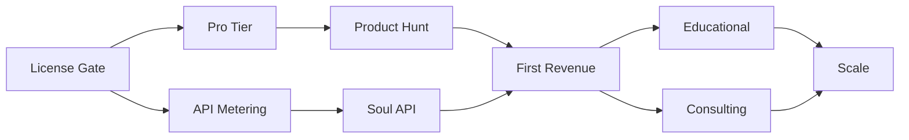

# Grand Initiative: kgents Monetization Strategy

> *"The spec compresses wisdom. The business compresses spec into value exchange."*

**Scope**: Transform kgents from a deep research project into sustainable revenue streams
**Exit Criteria**: 3+ revenue streams generating $10K+ MRR within 12 months
**Attention Budget**: 60% Product, 25% GTM, 10% Infrastructure, 5% Accursed Share

---

## Executive Summary

### The Opportunity

| Market Metric | Value | Source |
|---------------|-------|--------|
| AI Agent Market (2025) | $5.4B | Grand View Research |
| Projected Market (2030) | $50B+ | Grand View Research |
| Agentic AI Enterprise Revenue (2035) | $450B (30% of enterprise software) | Gartner |
| SaaS Revenue "Trapped" in Legacy Models | $300B | McKinsey |

### The kgents Advantage

1. **Differentiated Technology**: Category-theoretic foundations, AGENTESE protocol, polynomial functors
2. **Existing Depth**: 13,345 tests, K-gent persona (589 tests), 45+ Crown Jewels ready to ship
3. **Democratization Thesis**: Per AD-003, AI agents collapse expertise barriers
4. **Ethical Foundation**: 7 principles, human agency preserved, no deception

### The Gap

kgents has exceptional **depth** but lacks **surface area for revenue capture**:
- No pricing page
- No hosted service
- No commercial license
- No customer acquisition funnel

This initiative bridges spec → revenue.

---

## Part I: PLAN Phase

### Scope Definition

**In Scope**:
- Revenue stream design
- Pricing model selection
- MVP product definitions
- Go-to-market strategy
- Technical infrastructure requirements

**Out of Scope** (Non-Goals):
- Full SaaS platform build in phase 1
- Enterprise sales team
- Venture capital fundraising
- Patent/IP strategy

### Exit Criteria

| Milestone | Definition | Target |
|-----------|------------|--------|
| Revenue Stream Design | 3+ validated models | Week 2 |
| MVP Specification | Shippable product definition | Week 4 |
| Pricing Validation | Market-tested price points | Week 6 |
| First Revenue | $1 from any source | Week 8 |
| Sustainable Revenue | $10K+ MRR | Month 12 |

### Attention Budget

```
Product Development   [60%] ████████████░░░░░░░░
Go-to-Market         [25%] █████░░░░░░░░░░░░░░░
Infrastructure       [10%] ██░░░░░░░░░░░░░░░░░░
Accursed Share        [5%] █░░░░░░░░░░░░░░░░░░░
```

---

## Part II: RESEARCH Phase

### A. Market Research Findings

#### 1. AI Agent Pricing Models (2025)

| Model | Description | Examples | kgents Fit |
|-------|-------------|----------|------------|
| **Usage-Based** | Per API call, per token, per action | $0.002/email, $0.01/API call | HIGH - AGENTESE invocations metered |
| **Outcome-Based** | Per resolved issue, per completed task | Intercom Fin: $0.99/resolution | HIGH - K-gent governance outcomes |
| **Agent-as-Seat** | Monthly per deployed agent | Salesforce AELA | MEDIUM - K-gent as "digital employee" |
| **Hybrid** | Flat fee + usage overages | Writer: platform fee + tokens | HIGH - Best fit for kgents |

**Source**: [McKinsey AI SaaS](https://www.mckinsey.com/industries/technology-media-and-telecommunications/our-insights/upgrading-software-business-models-to-thrive-in-the-ai-era), [Chargebee AI Pricing](https://www.chargebee.com/blog/pricing-ai-agents-playbook/)

#### 2. Indie Hacker Patterns (2025)

| Pattern | Success Rate | Example | Application |
|---------|--------------|---------|-------------|
| Niche Down | 80%+ higher conversion | "Project management for wedding planners" | "Soul governance for ethical AI" |
| Validate Before Build | 3x faster to profitability | Pre-sales, landing pages | Product Hunt launch |
| Freemium Funnel | 15-25% conversion typical | Tier: Free → Pro → Enterprise | kgents CLI free, Pro features paid |
| Open-Core | 60% of successful OSS | Tabby, LibreChat | Core free, enterprise paid |

**Source**: [Indie Hackers](https://www.indiehackers.com/), [Monetizing OSS](https://www.indiehackers.com/post/tech/monetizing-two-open-source-projects-and-hitting-a-6-figure-arr-EprPnCt0LAVt0dmZoniL)

#### 3. Enterprise AI Adoption (2025)

| Trend | Statistic | Implication |
|-------|-----------|-------------|
| Multi-stage workflows | 57% of orgs deploy | K-gent governance fits |
| Cross-functional agents | 16% → 81% (2026 plan) | Integration Weaver value |
| AI-assisted development | 90% of orgs | Crown Jewels: parse, whatif |
| Production code agents | 86% deploy | CLI tools in workflow |

**Source**: [Anthropic Enterprise Survey](https://claude.com/blog/how-enterprises-are-building-ai-agents-in-2026), [Cognizant Partnership](https://www.anthropic.com/news/cognizant-partnership)

### B. kgents Asset Inventory

#### Monetizable Assets

| Asset | Current State | Commercial Potential |
|-------|---------------|----------------------|
| **K-gent Soul** | 589 tests, LLM-backed | Soul-as-a-Service (governance) |
| **Crown Jewels** | 45+ features designed | CLI SaaS bundle |
| **AGENTESE** | 559 tests, full protocol | Protocol licensing |
| **Category Theory Framework** | Complete foundations | Educational product |
| **Dashboard/Viz** | I-gent primitives | Embedded analytics |
| **Test Infrastructure** | 13,345 tests | Testing-as-a-Service |

#### Unique Value Propositions

1. **"Would Kent Approve?"** — Ethical code review with personality governance
2. **`kg whatif`** — Instant alternatives with reality classification
3. **`kg shadow`** — Jungian shadow analysis for decisions
4. **`kg dialectic`** — Hegelian synthesis for trade-offs
5. **`kg soul vibe`** — One-liner personality fingerprint

### C. Competitive Landscape

| Competitor | Focus | Pricing | kgents Differentiation |
|------------|-------|---------|------------------------|
| LangChain | Framework | Open-source + hosted | Category theory > ad-hoc chains |
| AutoGen | Multi-agent | Microsoft ecosystem | AGENTESE protocol |
| CrewAI | Team agents | $29-$299/mo | Soul governance |
| Anthropic (direct) | API access | Usage-based | Personality space navigation |

**Insight**: No competitor offers **personality-governed agents** with **category-theoretic guarantees**.

---

## Part III: DEVELOP Phase

### Revenue Stream Primitives

#### Stream 1: kgents Pro CLI (B2D)

**Model**: Freemium + Subscription
**Target**: Individual developers, indie hackers

| Tier | Price | Features |
|------|-------|----------|
| **Free** | $0 | Core CLI, 5 Crown Jewels, AGENTESE basics |
| **Pro** | $19/mo | All Crown Jewels, K-gent governance, priority LLM |
| **Teams** | $49/user/mo | Shared soul, team eigenvectors, audit logs |

**Implementation**:
```python
# impl/claude/protocols/licensing/tiers.py
class LicenseTier(Enum):
    FREE = "free"
    PRO = "pro"
    TEAMS = "teams"

@dataclass(frozen=True)
class LicenseGate:
    """Check feature access against license."""
    feature: str
    required_tier: LicenseTier

    async def check(self, user: User) -> bool:
        return user.tier >= self.required_tier
```

**Crown Jewels for Pro**:
- `kg soul *` (all commands)
- `kg shadow`, `kg dialectic`
- `kg whatif` with 5+ alternatives
- `kg parse` with all strategies
- `kg approve` (ethical review)

#### Stream 2: Soul-as-a-Service (B2B)

**Model**: Outcome-Based + API Access
**Target**: AI teams needing governance layer

| Pricing | Model | Use Case |
|---------|-------|----------|
| $0.10 | Per governance check | Code review, PR approval |
| $0.50 | Per deep intercept | Architecture decisions |
| $99/mo | Unlimited org | Startup governance layer |
| Custom | Enterprise | Full personality integration |

**Implementation**:
```python
# impl/claude/protocols/api/soul_service.py
@dataclass
class SoulServiceConfig:
    """API configuration for Soul-as-a-Service."""
    endpoint: str = "https://api.kgents.io/v1/soul"
    pricing: PricingModel = PricingModel.OUTCOME_BASED

async def invoke_soul_governance(
    action: str,
    context: dict,
    *,
    budget: TokenBudget = TokenBudget.DIALOGUE,
) -> GovernanceResult:
    """Remote K-gent governance check."""
    # ... metered invocation
```

**Value Proposition**: "Would Kent Approve?" as an API

#### Stream 3: Educational Products (B2C)

**Model**: One-time purchase + Cohort
**Target**: Developers learning agent design

| Product | Price | Format |
|---------|-------|--------|
| **Functor Field Guide** (enhanced) | $49 | PDF + Interactive |
| **Category Theory for AI Agents** | $149 | Video course |
| **kgents Mastery Cohort** | $499 | 6-week live |
| **Enterprise Workshop** | $2,500/day | On-site |

**Content Basis**: `docs/functor-field-guide.md`, `docs/categorical-foundations.md`, existing specs

#### Stream 4: Consulting & Implementation (B2B)

**Model**: Time-based + Project
**Target**: Enterprises building agent systems

| Service | Rate | Scope |
|---------|------|-------|
| Advisory Call | $250/hr | Architecture review |
| Implementation | $1,500/day | Hands-on building |
| Full Integration | $25K-$100K | Enterprise deployment |

**Differentiator**: Category-theoretic architecture + K-gent governance expertise

#### Stream 5: Open Core + Sponsors (Community)

**Model**: GitHub Sponsors + Enterprise Features
**Target**: OSS community, enterprises needing support

| Tier | Price | Perks |
|------|-------|-------|
| Supporter | $5/mo | Name in README, Discord role |
| Patron | $25/mo | Priority issues, monthly call |
| Sponsor | $100/mo | Logo in docs, feature input |
| Enterprise | $500/mo | SLA support, dedicated channel |

---

## Part IV: STRATEGIZE Phase

### Sequencing by Leverage

```
Phase 0 (Week 1-2): Foundation
├── License gating infrastructure
├── Stripe integration
└── Landing page

Phase 1 (Week 3-4): Free to Paid
├── Pro tier feature flags
├── Crown Jewels gated release
└── Product Hunt launch

Phase 2 (Week 5-8): API Monetization
├── Soul-as-a-Service API
├── Usage metering
└── Developer documentation

Phase 3 (Week 9-12): Educational
├── Enhanced Functor Field Guide
├── Video course recording
└── Workshop materials

Phase 4 (Month 4-6): Enterprise
├── Teams tier
├── Consulting pipeline
└── Case studies

Phase 5 (Month 6-12): Scale
├── Self-serve enterprise
├── Partner integrations
└── Geographic expansion
```

### Critical Path



### Risk Mitigation

| Risk | Probability | Impact | Mitigation |
|------|-------------|--------|------------|
| No market fit | Medium | High | Validate with landing page first |
| LLM cost spiral | High | Medium | Token budgets, caching, local models |
| Competition copies | Medium | Medium | Move fast, personality moat |
| Regulatory change | Low | High | Ethical foundation, compliance |
| Burnout | Medium | High | Parallel agents, sustainable pace |

---

## Part V: CROSS-SYNERGIZE Phase

### Revenue Stream Synergies

```
                    ┌─────────────────────────────────────────┐
                    │           REVENUE SYNERGY MAP            │
                    ├─────────────────────────────────────────┤
                    │                                          │
                    │   Pro CLI ──────────┬──────── Education  │
                    │      │              │              │      │
                    │      │     Crown Jewels as         │      │
                    │      │     course material         │      │
                    │      │              │              │      │
                    │      ▼              ▼              ▼      │
                    │   Soul API ◄────────────────► Consulting │
                    │      │                              │      │
                    │      │    API usage in workshops    │      │
                    │      │                              │      │
                    │      ▼                              ▼      │
                    │   GitHub Sponsors (community flywheel)   │
                    │                                          │
                    └─────────────────────────────────────────┘
```

### Cross-Product Compositions

| Composition | Revenue Impact | Implementation |
|-------------|----------------|----------------|
| Course → Pro Trial | 40% conversion typical | Auto-provision Pro on course signup |
| Pro → Consulting | $5K avg deal | "Need help?" CTA in Pro |
| API → Educational | Content marketing | API tutorials as course chapters |
| Sponsor → Pro | 60% upgrade rate | Sponsor perks include Pro |

### Agent Compositions for Revenue

| Agent Combination | Revenue Application |
|-------------------|---------------------|
| K-gent + Judge | Ethical code review service |
| K-gent + Uncertain | Risk-aware decision API |
| I-gent + Flux | Real-time dashboard SaaS |
| P-gent + U-gent | Self-healing pipeline service |
| H-gent + K-gent | "Soul Shadow" consulting |

### Dormant Tree Revival (Accursed Share)

Dormant plans with monetization potential:

1. **T-gent (90%)** → Testing-as-a-Service (Type I-V tests)
2. **B-gent (economics)** → Token budget optimization API
3. **Deployment chatbot (0%)** → Hosted K-gent demo

---

## Part VI: IMPLEMENT Phase Specification

### Technical Requirements

#### 1. License Infrastructure

```python
# impl/claude/protocols/licensing/__init__.py
from .tiers import LicenseTier, LicenseGate
from .stripe import StripeIntegration
from .usage import UsageMeter, TokenCounter

__all__ = [
    "LicenseTier",
    "LicenseGate",
    "StripeIntegration",
    "UsageMeter",
    "TokenCounter",
]
```

#### 2. API Service Layer

```python
# impl/claude/protocols/api/soul.py
from fastapi import FastAPI, Depends
from impl.claude.agents.k.soul import KgentSoul

app = FastAPI(title="kgents Soul API", version="1.0.0")

@app.post("/v1/soul/governance")
async def governance_check(
    request: GovernanceRequest,
    api_key: str = Depends(verify_api_key),
) -> GovernanceResponse:
    """Check if action aligns with soul governance."""
    soul = KgentSoul.from_api_key(api_key)
    result = await soul.deep_intercept(request.action, request.context)

    # Meter the usage
    await meter.record(api_key, "governance_check", tokens=result.tokens_used)

    return GovernanceResponse(
        approved=result.approved,
        reasoning=result.reasoning,
        alternatives=result.alternatives,
    )
```

#### 3. Usage Metering

```python
# impl/claude/protocols/licensing/usage.py
@dataclass
class UsageMeter:
    """Track API usage for billing."""

    async def record(
        self,
        user_id: str,
        action: str,
        *,
        tokens: int = 0,
        cost: Decimal = Decimal("0"),
    ) -> UsageRecord:
        """Record a metered action."""
        record = UsageRecord(
            user_id=user_id,
            action=action,
            tokens=tokens,
            cost=cost,
            timestamp=datetime.utcnow(),
        )
        await self.store.append(record)
        return record
```

### MVP Feature Set

#### Pro Tier (Week 3-4)

| Feature | Implementation | LOC Estimate |
|---------|----------------|--------------|
| License gate decorator | `@requires_tier(Pro)` | 50 |
| Feature flags | `FeatureFlag.CROWN_JEWELS` | 100 |
| Stripe checkout | Webhook integration | 200 |
| Pro commands unlock | 45 Crown Jewels | 500 |

#### Soul API (Week 5-8)

| Feature | Implementation | LOC Estimate |
|---------|----------------|--------------|
| FastAPI service | `/v1/soul/*` endpoints | 300 |
| API key management | `ApiKey` model + auth | 200 |
| Usage metering | Per-call tracking | 150 |
| Rate limiting | Token bucket | 100 |
| Documentation | OpenAPI + guides | 100 |

---

## Part VII: Implementation Prompt

### Execution Prompt for Parallel Agents

```markdown
/hydrate
# GRAND INITIATIVE: kgents Monetization - IMPLEMENT Phase

## Context
- Plan: plans/monetization/grand-initiative-monetization.md
- Phase: IMPLEMENT
- Ledger: PLAN=touched, RESEARCH=touched, DEVELOP=touched, STRATEGIZE=touched, CROSS-SYNERGIZE=touched, IMPLEMENT=in_progress

## Mission
Implement revenue infrastructure in parallel tracks.

## Track A: License Infrastructure (Agent 1)
Files: impl/claude/protocols/licensing/
Tasks:
1. Create LicenseTier enum (FREE, PRO, TEAMS)
2. Implement LicenseGate decorator
3. Add feature flag system
4. Write tests (target: 30+ tests)

## Track B: Stripe Integration (Agent 2)
Files: impl/claude/protocols/billing/
Tasks:
1. Stripe SDK integration
2. Webhook handlers (checkout.completed, subscription.*)
3. Customer portal link
4. Write tests with mocked Stripe

## Track C: Soul API Service (Agent 3)
Files: impl/claude/protocols/api/
Tasks:
1. FastAPI app scaffold
2. /v1/soul/governance endpoint
3. API key authentication
4. Usage metering middleware
5. OpenAPI documentation

## Track D: Pro Crown Jewels (Agent 4)
Files: impl/claude/protocols/cli/handlers/
Tasks:
1. Gate existing Crown Jewels with @requires_tier
2. Implement 5 highest-priority ungated Crown Jewels:
   - kg soul vibe
   - kg whatif
   - kg shadow
   - kg dialectic
   - kg parse
3. Write tests for each command

## Constraints
- All code must pass mypy strict
- All new code must have tests
- Follow AGENTESE patterns where applicable
- Preserve Ethical principle: no dark patterns in pricing

## Exit Criteria
- License infrastructure working (tests passing)
- Stripe checkout creates Pro user
- Soul API returns governance decisions
- 5 Crown Jewels gated and working
- Ledger: IMPLEMENT=touched, next=QA

## Entropy Budget
Draw: void.entropy.sip(0.07)
Return unused via: void.entropy.pour
```

### Landing Page Content Prompt

```markdown
/hydrate
# LANDING PAGE: kgents.io

## Mission
Create compelling landing page copy for kgents Pro.

## Sections

### Hero
Headline: "AI Governance with Soul"
Subhead: "The first agent framework with personality-governed decision making"
CTA: "Start Free" / "See Pricing"

### Problem
- AI agents make decisions without oversight
- Teams can't explain why their AI did something
- Ethics bolt-on, not built-in

### Solution
- K-gent: Governance functor with eigenvector personality
- AGENTESE: Observable agent-world interaction
- 45+ CLI commands for instant productivity

### Features (Crown Jewels)
1. "Would Kent Approve?" - Ethical code review
2. `kg whatif` - Instant alternatives
3. `kg shadow` - Jungian shadow analysis
4. `kg dialectic` - Hegelian synthesis
5. `kg soul vibe` - Personality fingerprint

### Pricing
Free / Pro $19 / Teams $49

### Social Proof
- 13,345 tests
- Category-theoretic foundations
- Open-core, ethical by design

### CTA
"Start Free - No Credit Card Required"
```

---

## Part VIII: Success Metrics

### Revenue Metrics

| Metric | Week 4 | Week 8 | Month 6 | Month 12 |
|--------|--------|--------|---------|----------|
| MRR | $0 | $500 | $5,000 | $15,000+ |
| Pro Subscribers | 0 | 30 | 200 | 500+ |
| API Calls/day | 0 | 100 | 5,000 | 50,000+ |
| Course Sales | 0 | 10 | 100 | 500 |

### Product Metrics

| Metric | Target | Measurement |
|--------|--------|-------------|
| CLI → Pro Conversion | 5% | Stripe events |
| API Response Time | <200ms p95 | OTEL traces |
| NPS (Pro users) | >50 | Quarterly survey |
| Crown Jewel Usage | 10 commands/user/day | Usage metering |

### Process Metrics

| Metric | Target | Source |
|--------|--------|--------|
| Features Shipped/Week | 3+ | GitHub releases |
| Test Coverage | >90% | pytest-cov |
| Mypy Errors | 0 | CI/CD |
| Debt Ratio | <20% | Code review |

---

## Part IX: Changelog & Continuation

### Changelog

- 2025-12-14: Initial plan creation (PLAN → CROSS-SYNERGIZE phases)
- Research: 6 web searches, 2 parallel agents, 15+ internal files
- Market sizing: $5.4B (2025) → $50B (2030)
- 5 revenue streams designed
- Implementation prompt ready

### Next Continuation

```markdown
/hydrate
# QA ← IMPLEMENT (after Track A-D complete)
handles: code=${files_created}; tests=${test_files}; results=${test_counts}
mission: gate quality/security/lawfulness before launch.
actions: uv run mypy .; uv run ruff check; security sweep; license audit.
exit: QA checklist passed; ledger.QA=touched; continuation → TEST.
```

---

## Appendix A: Source Links

### Market Research
- [McKinsey: AI SaaS Monetization](https://www.mckinsey.com/industries/technology-media-and-telecommunications/our-insights/upgrading-software-business-models-to-thrive-in-the-ai-era)
- [Chargebee: AI Pricing Playbook](https://www.chargebee.com/blog/pricing-ai-agents-playbook/)
- [Metronome: AI Pricing 2025](https://metronome.com/blog/ai-pricing-in-practice-2025-field-report-from-leading-saas-teams)
- [High Alpha: SaaS AI Predictions](https://www.highalpha.com/blog/how-saas-companies-are-monetizing-ai-and-predictions-for-2025)

### Indie Hacker Patterns
- [Indie Hackers: OSS Monetization](https://www.indiehackers.com/post/tech/monetizing-two-open-source-projects-and-hitting-a-6-figure-arr-EprPnCt0LAVt0dmZoniL)
- [Solo Developer Guide 2025](https://calmops.com/tools/the-complete-guid-to-becoming-a-successful-solo-developer-in-2025/)
- [Micro SaaS Ideas 2025](https://www.sidetool.co/post/micro-saas-2025-7-high-profit-ideas-for-solo-founders/)

### Enterprise AI
- [Anthropic: Enterprise AI 2026](https://claude.com/blog/how-enterprises-are-building-ai-agents-in-2026)
- [Cognizant Partnership](https://www.anthropic.com/news/cognizant-partnership)
- [Claude Opus 4.5 Launch](https://www.anthropic.com/news/claude-opus-4-5)

### Open Source Monetization
- [AgentPayy Framework](https://github.com/AgentPayy/AgentPayy)
- [GitHub: AI Agent Projects](https://github.blog/open-source/accelerate-developer-productivity-with-these-9-open-source-ai-and-mcp-projects/)
- [Hugging Face: OSS Agents](https://huggingface.co/blog/tegridydev/open-source-ai-agents-directory)

---

*"The business model is a functor from Value to Exchange. Make it lawful."*
