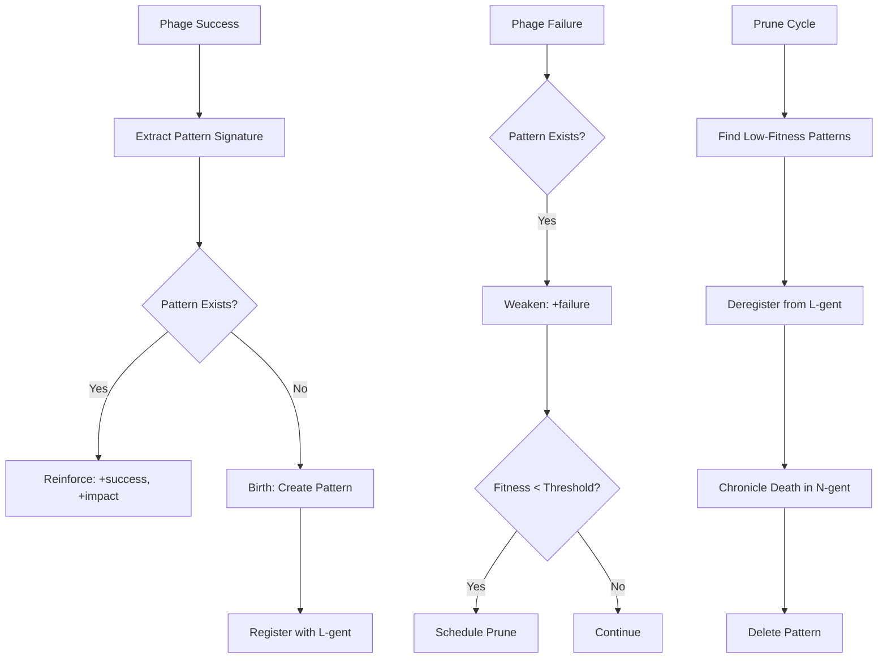

# Memory Agents → Viral Library

**From outcome recording to DNA propagation**

## The Evolution

The original "Memory Agents" concept suffered from **passive accumulation**:
- Recorded outcomes without evolving
- Grew unboundedly without fitness pressure
- Prevented repetition but didn't guide generation

The **Viral Library** replaces passive memory with **active evolution**:

1. **DNA propagation**: Successful patterns replicate to future Phages
2. **Fitness decay**: Failed patterns weaken and eventually die
3. **Semantic retrieval**: L-gent integration enables similarity-based lookup
4. **Market integration**: Pattern fitness influences odds calculation

## The Core Insight

Memory is not a filing cabinet. Memory is a **living library** where:
- Strong patterns reproduce (high fitness → more offspring)
- Weak patterns die (low fitness → eventual removal)
- The library **evolves** toward fitness, not just accumulates

## What It Does

- **Store successful DNA**: Patterns from successful Phages enter the library
- **Weaken failed patterns**: Each failure decreases pattern fitness
- **Guide mutation**: Mutator draws from library based on semantic similarity
- **Inform markets**: Pattern fitness feeds into odds calculation
- **Evolve over time**: Low-fitness patterns are pruned; high-fitness patterns dominate

## What It Doesn't Do

- ❌ Accumulate unboundedly (fitness pressure prunes weak patterns)
- ❌ Just prevent repetition (it actively guides generation)
- ❌ Store outcomes (it stores DNA and fitness)
- ❌ Operate in isolation (requires L-gent for semantics, B-gent for market)

## Specification: Viral Library

```yaml
identity:
  name: ViralLibrary
  genus: e
  version: "2.0.0"
  purpose: Store and evolve successful mutation patterns with fitness tracking

interface:
  input:
    type: LibraryOperation
    description: Record success/failure, query patterns, prune low-fitness
  output:
    type: LibraryResult
    description: Pattern suggestions, fitness scores, prune reports
  errors:
    - code: STORAGE_ERROR
      description: Failed to persist to D-gent backend
    - code: LGENT_UNAVAILABLE
      description: Cannot connect to L-gent SemanticRegistry

behavior:
  description: |
    Maintains an EVOLVING library of mutation patterns:

    **On Phage Success**:
    - Extract pattern signature from Phage DNA
    - If pattern exists: increment success_count, add to total_impact
    - If pattern new: create entry, register with L-gent SemanticRegistry
    - Update fitness score: success_rate × avg_impact

    **On Phage Failure**:
    - Find pattern by signature
    - Increment failure_count
    - Recalculate fitness (may drop below prune threshold)

    **On Query**:
    - Use L-gent semantic similarity to find relevant patterns
    - Return patterns sorted by (similarity × fitness)
    - Generate MutationVectors from matching patterns

    **On Prune** (periodic):
    - Remove patterns with fitness below threshold
    - Deregister from L-gent SemanticRegistry
    - Log pruned patterns to N-gent chronicle

  guarantees:
    - Patterns with high fitness grow; low fitness shrink
    - Semantic retrieval via L-gent (not just exact match)
    - Persistence via D-gent (survives restarts)
    - Pruning prevents unbounded growth

  constraints:
    - Requires L-gent SemanticRegistry for semantic retrieval
    - Requires D-gent for persistence
    - Fitness calculation is heuristic (not provably optimal)
    - Pruning threshold is configurable per library

  side_effects:
    - Registers/deregisters patterns in L-gent SemanticRegistry
    - Persists state to D-gent backend
    - Emits observations to O-gent (birth/death rates)

state:
  schema: ViralLibraryState
  persistence: persistent (D-gent)
  initial:
    patterns: {}
    total_successes: 0
    total_failures: 0

types:
  ViralLibraryState:
    patterns: dict<signature, ViralPattern>
    total_successes: number
    total_failures: number

  ViralPattern:
    signature: string           # Pattern identifier
    dna: string                 # Template code/diff
    success_count: number       # Times this pattern succeeded
    failure_count: number       # Times this pattern failed
    total_impact: number        # Cumulative impact from successes
    avg_cost: number            # Average token cost
    exemplar_module: string     # First module where pattern succeeded
    created_at: timestamp
    last_used: timestamp

  LibraryOperation:
    type: "record_success" | "record_failure" | "query" | "prune"
    phage: Phage | null         # For record operations
    context: CodeStructure | null  # For query operations
    threshold: number | null    # For prune operations

  LibraryResult:
    type: "recorded" | "patterns" | "pruned"
    patterns: array<ViralPattern> | null
    pruned_count: number | null

  # Fitness calculation
  # fitness = success_rate × avg_impact
  # success_rate = success_count / (success_count + failure_count)
  # avg_impact = total_impact / max(1, success_count)
```

## Recording Outcomes

### On Phage Success

```python
# When a Phage successfully infects the codebase
library.record_success(
    phage=successful_phage,
    impact=measured_impact,  # From test coverage, complexity reduction, etc.
)
```

Internally:

```python
def record_success(self, phage: Phage, impact: float) -> None:
    signature = phage.pattern_signature

    if signature in self.patterns:
        # Existing pattern: reinforce
        pattern = self.patterns[signature]
        pattern.success_count += 1
        pattern.total_impact += impact
        pattern.last_used = now()
    else:
        # New pattern: birth
        pattern = ViralPattern(
            signature=signature,
            dna=phage.mutation_dna,
            success_count=1,
            failure_count=0,
            total_impact=impact,
            avg_cost=phage.entropy_cost,
            exemplar_module=phage.target_module,
            created_at=now(),
            last_used=now(),
        )
        self.patterns[signature] = pattern

        # Register with L-gent for semantic retrieval
        self.l_gent.register_archetype(
            name=f"viral:{signature}",
            embedding=self._embed(pattern),
        )

    self.total_successes += 1
```

### On Phage Failure

```python
# When a Phage fails to infect (tests fail, types break, etc.)
library.record_failure(phage=failed_phage)
```

Internally:

```python
def record_failure(self, phage: Phage) -> None:
    signature = phage.pattern_signature

    if signature in self.patterns:
        pattern = self.patterns[signature]
        pattern.failure_count += 1
        pattern.last_used = now()

        # Check for death condition
        if pattern.fitness < self.prune_threshold:
            self._schedule_prune(signature)

    self.total_failures += 1
```

### Fitness Calculation

```python
@property
def fitness(self) -> float:
    """Darwinian fitness: success_rate × avg_impact"""
    if self.success_count + self.failure_count == 0:
        return 0.0

    success_rate = self.success_count / (self.success_count + self.failure_count)
    avg_impact = self.total_impact / max(1, self.success_count)

    return success_rate * avg_impact
```

**Interpretation**:
- fitness > 1.0: High-value pattern (succeeds often with high impact)
- fitness 0.5-1.0: Viable pattern (moderate success, moderate impact)
- fitness < 0.5: Weak pattern (candidate for pruning)

## Querying the Library

### Suggest Mutations for a Module

```python
# Get mutation suggestions based on module context
suggestions = library.suggest_mutations(
    module=code_module,
    context=ast_structure,
    top_k=10,
)

# Returns MutationVectors derived from high-fitness patterns
# Sorted by: similarity_to_context × pattern_fitness
```

Internally:

```python
def suggest_mutations(
    self,
    module: CodeModule,
    context: CodeStructure,
    top_k: int = 10,
) -> list[MutationVector]:
    # Use L-gent to find semantically similar patterns
    context_embedding = self._embed_context(context)
    similar = self.l_gent.find_similar(
        context=context_embedding,
        prefix="viral:",
        top_k=top_k * 2,  # Get extras for filtering
    )

    suggestions = []
    for pattern_name, similarity in similar:
        signature = pattern_name[6:]  # Remove "viral:" prefix
        pattern = self.patterns[signature]

        # Score by similarity × fitness
        score = similarity * pattern.fitness

        suggestions.append(MutationVector(
            kind=self._infer_kind(pattern),
            target=self._find_target(module, pattern),
            hint=self._generate_hint(pattern),
            entropy_cost=pattern.avg_cost,
            source_pattern=signature,
            score=score,
        ))

    # Sort by score, return top_k
    suggestions.sort(key=lambda x: x.score, reverse=True)
    return suggestions[:top_k]
```

### Get Pattern Fitness

```python
# Used by Prediction Market to calculate odds
fitness = library.get_fitness(pattern_signature)

# Returns float (0.0 to unbounded, typically 0.0-2.0)
```

### Get Library Statistics

```python
stats = library.get_stats()

# Returns:
{
    "total_patterns": 150,
    "total_successes": 450,
    "total_failures": 900,
    "avg_fitness": 0.72,
    "high_fitness_patterns": 45,   # fitness > 1.0
    "low_fitness_patterns": 30,    # fitness < 0.3
    "patterns_by_kind": {
        "substitute": 50,
        "extract": 40,
        "annotate": 35,
        "restructure": 25,
    }
}
```

## Integration with Thermodynamic Cycle

### Stage 1: Mutate (Library-Guided Generation)

```python
async def generate_mutations(module: CodeModule) -> list[MutationVector]:
    # Analyze code structure
    structure = await ast_analyzer.analyze(module)

    # Get library suggestions (pattern-guided)
    library_suggestions = library.suggest_mutations(
        module=module,
        context=structure,
        top_k=5,
    )

    # Add stochastic mutations (random exploration)
    random_mutations = mutator.shotgun(
        module=module,
        count=5,
    )

    # Combine: library patterns + random exploration
    return library_suggestions + random_mutations
```

### Stage 5: Payoff (Library Update)

```python
async def update_library(result: InfectionResult, receipt: BetReceipt) -> None:
    if result.success:
        # Measure impact
        impact = await measure_impact(result)

        # Record success → pattern reinforced
        library.record_success(
            phage=result.phage,
            impact=impact,
        )

        # Settle bet → tokens earned
        await market.settle(receipt, success=True, impact=impact)
    else:
        # Record failure → pattern weakened
        library.record_failure(phage=result.phage)

        # Settle bet → tokens lost
        await market.settle(receipt, success=False, impact=0.0)
```

### Market Integration

```python
# Prediction Market uses library fitness for odds calculation
async def calculate_odds(phage: Phage) -> float:
    pattern_fitness = library.get_fitness(phage.pattern_signature)

    # High fitness → low odds (likely to succeed)
    # Low fitness → high odds (unlikely to succeed)
    if pattern_fitness > 0.8:
        return 1.25  # 80% expected success
    elif pattern_fitness > 0.5:
        return 2.0   # 50% expected success
    elif pattern_fitness > 0.2:
        return 5.0   # 20% expected success
    else:
        return 10.0  # 10% expected success (new/weak pattern)
```

## Pruning: Natural Selection

Unlike passive memory that accumulates forever, the Viral Library **prunes weak patterns**:

```python
async def prune(self, threshold: float = 0.3) -> PruneReport:
    """
    Remove patterns with fitness below threshold.

    This is natural selection: weak patterns die,
    making room for new experiments.
    """
    to_prune = [
        sig for sig, pattern in self.patterns.items()
        if pattern.fitness < threshold
    ]

    for sig in to_prune:
        # Deregister from L-gent
        self.l_gent.deregister_archetype(f"viral:{sig}")

        # Log to N-gent chronicle
        await self.n_gent.chronicle(
            event="pattern_death",
            signature=sig,
            fitness=self.patterns[sig].fitness,
            lifespan=now() - self.patterns[sig].created_at,
        )

        # Remove from library
        del self.patterns[sig]

    return PruneReport(
        pruned_count=len(to_prune),
        remaining_count=len(self.patterns),
        avg_fitness=self._compute_avg_fitness(),
    )
```

**Pruning Schedule**:
- After every N infections (e.g., 100)
- When library size exceeds threshold (e.g., 1000 patterns)
- On explicit maintenance command

## Library Lifecycle



## Anti-Patterns

❌ **Don't accumulate forever**

```python
# WRONG: Passive accumulation
memory.record(outcome)  # Just keeps growing

# RIGHT: Fitness-based evolution
library.record_success(phage, impact)  # Patterns evolve
library.prune(threshold=0.3)           # Weak patterns die
```

❌ **Don't prevent all repetition**

```python
# WRONG: Block anything similar
if memory.was_rejected(hypothesis):
    skip()  # Prevents learning from near-misses

# RIGHT: Let fitness guide probability
suggestions = library.suggest_mutations(context)
# Low-fitness patterns less likely to be suggested
# But they CAN still appear (exploration)
```

❌ **Don't ignore market signals**

```python
# WRONG: Use library fitness directly
if library.get_fitness(pattern) > 0.5:
    proceed()

# RIGHT: Let market incorporate fitness into odds
quote = market.quote(phage)  # Uses library fitness + other factors
if quote.expected_value > phage.entropy_cost:
    proceed()
```

❌ **Don't store outcomes, store DNA**

```python
# WRONG: Old memory model
record = {
    "outcome": "accepted",
    "rationale": "Improved readability",
}

# RIGHT: Viral Library model
pattern = ViralPattern(
    dna=phage.mutation_dna,
    success_count=1,
    total_impact=measured_impact,
)
```

## Composability with Other Gents

### With L-gent (Semantic Registry)

```python
# L-gent provides semantic retrieval for the library
class ViralLibrary:
    def __init__(self, l_gent: SemanticRegistry):
        self.l_gent = l_gent

    def suggest_mutations(self, context: CodeStructure) -> list[MutationVector]:
        # Use L-gent to find semantically similar patterns
        similar = self.l_gent.find_similar(
            context=self._embed_context(context),
            prefix="viral:",
        )
        return self._patterns_to_vectors(similar)
```

### With B-gent (Prediction Market)

```python
# B-gent uses library fitness for odds calculation
class PredictionMarket:
    def __init__(self, library: ViralLibrary):
        self.library = library

    async def quote(self, phage: Phage) -> MarketQuote:
        pattern_fitness = self.library.get_fitness(phage.pattern_signature)
        # High fitness → low odds → more likely to succeed
        base_probability = 0.5 + (pattern_fitness * 0.3)  # Clamped 0.2-0.8
        ...
```

### With D-gent (Persistence)

```python
# D-gent provides persistent storage for the library
class ViralLibrary:
    def __init__(self, d_gent: DataAgent):
        self.d_gent = d_gent
        self.patterns = d_gent.get("viral_patterns", {})

    async def _persist(self):
        await self.d_gent.set("viral_patterns", self.patterns)
```

### With O-gent (Observation)

```python
# O-gent tracks library health metrics
class ViralLibrary:
    def __init__(self, o_gent: ObservationCoordinator):
        self.o_gent = o_gent

    async def record_success(self, phage, impact):
        # ... normal logic ...
        await self.o_gent.emit(
            "library.pattern_reinforced",
            signature=phage.pattern_signature,
            new_fitness=pattern.fitness,
        )
```

## See Also

- **[thermodynamics.md](./thermodynamics.md)** - Full thermodynamic model
- **[evolution-agent.md](./evolution-agent.md)** - How library integrates into cycle
- **[grounding.md](./grounding.md)** - AST analysis for pattern context
- **[B-gents/banker.md](../b-gents/banker.md)** - Prediction market economics
- **[L-gents](../l-gents/)** - Semantic registry for pattern retrieval

---

*"The library that never forgets will never learn. Evolution requires death."*
