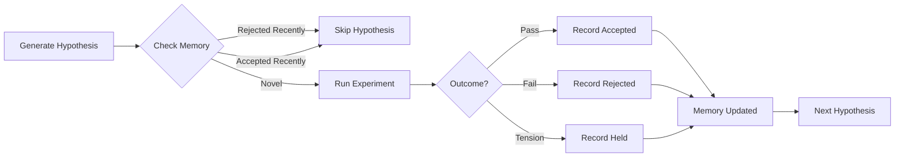

# Memory Agents

**Institutional memory for evolutionary learning**

## Purpose

Memory agents provide **institutional learning** across evolution sessions:

1. **Prevent repetition**: Don't re-propose recently rejected hypotheses
2. **Accelerate convergence**: Skip known failure patterns
3. **Preserve knowledge**: Remember what worked and what didn't, across sessions
4. **Pattern recognition**: Identify recurring failure modes for prompt refinement
5. **Decision audit**: Maintain record of all accept/reject decisions with rationale

Memory is **persistent** (file-based), **queryable** (by module/hypothesis similarity), and **composable** (fits naturally in the pipeline).

## What It Does

- **Record outcomes**: Log accepted, rejected, and held improvements with rationale
- **Filter hypotheses**: Check if a hypothesis was recently rejected or accepted
- **Track patterns**: Identify recurring failure types across modules
- **Provide context**: Inform prompt engineering with known failure patterns
- **Enable audit**: Review past decisions for pattern analysis

## What It Doesn't Do

- ❌ Make decisions (only provides data, doesn't judge)
- ❌ Forget on purpose (no automatic expiration, human must prune)
- ❌ Share across projects (memory is per-repository)
- ❌ Store code (only metadata: hypothesis, outcome, rationale)

## Specification: Improvement Memory

```yaml
identity:
  name: ImprovementMemory
  genus: e
  version: "1.0.0"
  purpose: Track evolution outcomes to prevent repetition and enable learning

interface:
  input:
    type: MemoryQuery | RecordInput
    description: Query past outcomes or record new outcome
  output:
    type: MemoryQueryResult | RecordResult
    description: Whether hypothesis was seen, or confirmation of recording
  errors:
    - code: STORAGE_ERROR
      description: Failed to read or write memory file
    - code: INVALID_OUTCOME
      description: Outcome must be "accepted", "rejected", or "held"

behavior:
  description: |
    Maintains a persistent log of evolution outcomes:

    **Recording**:
    - When hypothesis is accepted/rejected/held, record to memory
    - Store: module name, hypothesis, description, outcome, rationale, timestamp
    - Append to JSON file (`.evolve_memory.json`)

    **Querying**:
    - Check if hypothesis was recently rejected (by similarity)
    - Check if hypothesis was recently accepted (avoid redundancy)
    - Retrieve rejection rationale for similar hypotheses
    - Query failure patterns by module or error type

    **Similarity matching**:
    - Use Levenshtein distance for fuzzy matching
    - Similarity threshold: 0.8 (80% match)
    - Considers both hypothesis text and improvement description

  guarantees:
    - Memory persists across Python processes (file-based)
    - Records are append-only (never deleted automatically)
    - Similarity matching is deterministic (same input → same result)
    - Thread-safe for concurrent module processing

  constraints:
    - Memory file must be writable (evolve working directory)
    - Similarity threshold is fixed (not configurable per query)
    - No automatic expiration (memory grows unbounded)
    - Fuzzy matching is O(n) in memory size

  side_effects:
    - Writes to `.evolve_memory.json` on record()
    - Reads from `.evolve_memory.json` on query

state:
  schema: ImprovementMemoryState
  persistence: persistent
  initial:
    records: []
    last_updated: null

types:
  ImprovementMemoryState:
    records: array<ImprovementRecord>
    last_updated: timestamp | null

  ImprovementRecord:
    module: string
    hypothesis: string
    description: string
    outcome: "accepted" | "rejected" | "held"
    rationale: string | null
    timestamp: timestamp
    rejection_reason: string | null  # Only for rejected outcomes

  MemoryQuery:
    module: string
    hypothesis: string
    query_type: "was_rejected" | "was_accepted" | "get_patterns"

  MemoryQueryResult:
    found: boolean
    record: ImprovementRecord | null
    similarity: number  # 0.0 to 1.0

  RecordInput:
    module: string
    hypothesis: string
    description: string
    outcome: "accepted" | "rejected" | "held"
    rationale: string | null
    rejection_reason: string | null

  RecordResult:
    success: boolean
    error: string | null
```

## Recording Outcomes

### On Acceptance

```python
memory.record(
    module="data_processor",
    hypothesis="Refactor process method (complexity 11) into smaller functions",
    description="Split into validate, transform, and save methods",
    outcome="accepted",
    rationale="Improved composability and testability",
)
```

Stored as:

```json
{
  "module": "data_processor",
  "hypothesis": "Refactor process method (complexity 11) into smaller functions",
  "description": "Split into validate, transform, and save methods",
  "outcome": "accepted",
  "rationale": "Improved composability and testability",
  "rejection_reason": null,
  "timestamp": "2024-01-15T10:30:00Z"
}
```

### On Rejection (Test Failure)

```python
memory.record(
    module="data_processor",
    hypothesis="Replace class with functional pipeline",
    description="Convert DataProcessor to pure functions",
    outcome="rejected",
    rationale="Failed type checking",
    rejection_reason="mypy error: Cannot assign lambda to Callable[[dict], dict]",
)
```

### On Rejection (Principle Violation)

```python
memory.record(
    module="data_processor",
    hypothesis="Add caching layer with global state",
    description="Use module-level cache dict for performance",
    outcome="rejected",
    rationale="Violates composability principle (global state)",
    rejection_reason="CodeJudge verdict: REJECT - Global state breaks composability",
)
```

### On Held Tension

```python
memory.record(
    module="data_processor",
    hypothesis="Switch from inheritance to composition",
    description="Replace BaseProcessor inheritance with composition",
    outcome="held",
    rationale="Productive tension: inheritance provides useful defaults, composition improves testability",
)
```

## Querying Memory

### Check if Rejected Recently

```python
rejection = memory.was_rejected(
    module="data_processor",
    hypothesis="Refactor process method into smaller functions"
)

if rejection:
    print(f"Previously rejected: {rejection.rejection_reason}")
    # Skip this hypothesis
else:
    # Proceed with experiment
```

**Fuzzy matching**: "Refactor process method" matches "Refactor DataProcessor.process" at 85% similarity.

### Check if Accepted Recently

```python
if memory.was_recently_accepted(
    module="data_processor",
    hypothesis="Add type annotations to all methods"
):
    print("Already accepted similar improvement recently")
    # Skip to avoid redundant work
```

**Recency window**: Last 7 days by default (configurable).

### Get Failure Patterns

```python
patterns = memory.get_failure_patterns(module="data_processor")

# Returns:
[
    {
        "pattern": "mypy type errors",
        "count": 3,
        "examples": [
            "Cannot assign lambda to Callable[[dict], dict]",
            "Incompatible return type List[str] vs List[Any]",
            ...
        ]
    },
    {
        "pattern": "pytest failures",
        "count": 2,
        "examples": [...]
    }
]
```

Used to inform prompt engineering: "Previous attempts failed due to mypy type errors. Be careful with lambda type annotations."

## Integration with Evolution Pipeline

### Stage 3: Hypothesis Filtering

```python
async def generate_hypotheses(module: CodeModule) -> list[str]:
    # Generate hypotheses (AST + LLM)
    all_hypotheses = ast_hypotheses + llm_hypotheses

    # Filter by memory
    filtered = []
    for h in all_hypotheses:
        # Skip if recently rejected
        if memory.was_rejected(module.name, h):
            log(f"Skipping rejected: {h}")
            continue

        # Skip if recently accepted (avoid redundancy)
        if memory.was_recently_accepted(module.name, h):
            log(f"Skipping recently accepted: {h}")
            continue

        filtered.append(h)

    return filtered
```

### Stage 4: Prompt Context Enhancement

```python
async def _generate_improvement(module: CodeModule, hypothesis: str):
    # Get failure patterns for this module
    patterns = memory.get_failure_patterns(module.name)

    # Build prompt with failure awareness
    prompt = f"""
Previous attempts on {module.name} failed due to:
{format_patterns(patterns)}

Avoid these specific errors when generating improvement.

Hypothesis: {hypothesis}
...
"""
    return await llm.generate(prompt)
```

### Stage 5: Recording Judge Verdict

```python
async def judge_experiment(experiment: Experiment) -> Verdict:
    verdict = await code_judge.invoke(JudgeInput(...))

    if verdict.type == VerdictType.REJECT:
        # Record rejection
        memory.record(
            module=experiment.module.name,
            hypothesis=experiment.hypothesis,
            description=experiment.improvement.description,
            outcome="rejected",
            rationale=verdict.reasoning,
            rejection_reason=f"Principle violation: {verdict.reasoning}",
        )

    return verdict
```

## Specification: Error Memory

```yaml
identity:
  name: ErrorMemory
  genus: e
  version: "1.0.0"
  purpose: Track and learn from failure patterns across sessions

interface:
  input:
    type: ErrorRecordInput | ErrorPatternQuery
    description: Record failure or query patterns
  output:
    type: ErrorRecordResult | ErrorPatternResult
    description: Confirmation or failure patterns
  errors:
    - code: STORAGE_ERROR
      description: Failed to access error memory storage

behavior:
  description: |
    Specialized memory for tracking **failure patterns**:

    - Records: module, hypothesis, failure_type, failure_details, timestamp
    - Categorizes: syntax, type, import, test, unknown
    - Aggregates: Count failures by category, identify recurring patterns
    - Warns: Alert if hypothesis matches known failure pattern

    Used to improve prompt engineering and retry strategies.

  guarantees:
    - Pattern detection is fuzzy (matches similar errors)
    - Warning thresholds are configurable
    - Records persist across sessions

  constraints:
    - Requires categorization of errors (syntax, type, import, test)
    - Pattern matching is heuristic (may miss novel failures)

types:
  ErrorRecordInput:
    module_category: string
    module_name: string
    hypothesis: string
    failure_type: "syntax" | "type" | "import" | "test" | "unknown"
    failure_details: string

  ErrorPatternQuery:
    module_name: string | null
    failure_type: string | null
    min_count: number

  ErrorPattern:
    failure_type: string
    count: number
    modules: array<string>
    example_details: array<string>

  ErrorWarning:
    hypothesis: string
    similar_failures: array<ErrorPattern>
    confidence: number
```

## Error Memory Usage

### Recording Failures

```python
error_memory.record_failure(
    module_category="agents/e",
    module_name="evolution",
    hypothesis="Add async context manager for file operations",
    failure_type="syntax",
    failure_details="SyntaxError: invalid syntax at line 45: async with open(...)",
)
```

### Querying Patterns

```python
patterns = error_memory.get_patterns(
    module_name="evolution",
    min_count=2,  # At least 2 occurrences
)

# Returns patterns like:
[
    ErrorPattern(
        failure_type="syntax",
        count=3,
        modules=["evolution", "experiment"],
        example_details=[
            "SyntaxError: invalid syntax at line 45",
            "SyntaxError: unexpected indent at line 120",
            ...
        ]
    )
]
```

### Warning on Retry

```python
# Before retry attempt
warnings = error_memory.check_warnings(
    module_name="evolution",
    hypothesis="Add async context manager for file operations"
)

if warnings:
    # Include warning in retry prompt
    prompt = f"""
WARNING: Similar hypotheses have failed before:
{format_warnings(warnings)}

Be especially careful to avoid these specific errors.

Hypothesis: {hypothesis}
...
"""
```

## Memory Composability

Memory agents are **stateful but composable**:

```python
# Morphism with side effects
MemoryAgent: MemoryQuery → MemoryQueryResult  # (+ writes to file)

# Composes with hypothesis generator
filtered_hypotheses = (
    hypothesis_generator
    >> memory_filter  # Uses MemoryAgent internally
)

# Composes with experiment runner
experiment_with_memory = (
    experiment_runner
    >> record_outcome  # Uses MemoryAgent to record result
)
```

The key insight: **side effects don't break composition** when they're well-defined and composable.

## Memory File Format

`.evolve_memory.json`:

```json
{
  "version": "1.0.0",
  "records": [
    {
      "module": "evolution",
      "hypothesis": "Refactor EvolutionPipeline into smaller agents",
      "description": "Split into ASTAnalyzer, HypothesisEngine, etc.",
      "outcome": "accepted",
      "rationale": "Improved composability and testability",
      "rejection_reason": null,
      "timestamp": "2024-01-15T10:30:00Z"
    },
    {
      "module": "evolution",
      "hypothesis": "Add caching layer for AST analysis",
      "description": "Cache AST results in-memory dict",
      "outcome": "accepted",
      "rationale": "Reduces redundant parsing, improves performance",
      "rejection_reason": null,
      "timestamp": "2024-01-15T11:00:00Z"
    },
    {
      "module": "experiment",
      "hypothesis": "Use global state for experiment tracking",
      "description": "Module-level experiment registry",
      "outcome": "rejected",
      "rationale": "Violates composability (global state)",
      "rejection_reason": "CodeJudge verdict: REJECT - Global state prevents parallel execution",
      "timestamp": "2024-01-15T11:30:00Z"
    }
  ]
}
```

## Memory Lifecycle



## Memory Statistics

```python
stats = memory.get_stats()

# Returns:
{
    "total_records": 150,
    "accepted": 45,
    "rejected": 90,
    "held": 15,
    "modules": {
        "evolution": {"accepted": 10, "rejected": 20},
        "experiment": {"accepted": 8, "rejected": 15},
        ...
    },
    "rejection_reasons": {
        "Test failure": 35,
        "Type error": 25,
        "Principle violation": 20,
        "Syntax error": 10
    }
}
```

Used for analysis and reporting:
- Which modules are hardest to evolve? (highest reject rate)
- What are common rejection reasons? (inform prompt engineering)
- Is evolution converging? (accept rate increasing over time)

## Anti-Patterns

❌ **Don't use memory as a cache**

```python
# WRONG: Memory is for outcomes, not caching AST results
memory.record(module="evolution", outcome="cached", rationale="AST result")

# RIGHT: Use dedicated cache for AST
ast_cache[module.path] = structure
```

❌ **Don't delete records manually**

```python
# WRONG: Breaks institutional learning
memory.delete(record_id)

# RIGHT: Let memory grow, prune only via explicit maintenance command
# (e.g., python evolve.py memory --prune-before 2024-01-01)
```

❌ **Don't trust similarity matching blindly**

```python
# WRONG: Fuzzy matching can miss near-duplicates
if not memory.was_rejected(module, hypothesis):
    proceed()  # Might still be rejected for same reason!

# RIGHT: Use memory as a filter, not absolute truth
rejection = memory.was_rejected(module, hypothesis)
if rejection and rejection.similarity > 0.9:
    log(f"Very similar hypothesis was rejected: {rejection.rejection_reason}")
    # Still proceed if you think it's different enough
```

❌ **Don't record outcomes without rationale**

```python
# WRONG: No learning from outcome
memory.record(module="evolution", outcome="rejected", rationale=None)

# RIGHT: Always include rationale for learning
memory.record(
    module="evolution",
    outcome="rejected",
    rationale="Failed mypy type check",
    rejection_reason="Incompatible return type: Expected Foo, got Bar"
)
```

## Composability with Other Gents

### With B-gents (Hypothesis Engine)

```python
# Memory informs hypothesis generation
previous_rejections = memory.get_patterns(module.name)

hypothesis_input = HypothesisInput(
    observations=[...],
    constraints=[
        f"Avoid patterns that failed before: {previous_rejections}",
        ...
    ]
)

hypotheses = await hypothesis_engine.invoke(hypothesis_input)
```

### With H-gents (Sublate)

```python
# Held tensions are recorded in memory for pattern analysis
if isinstance(sublate_result, HoldTension):
    memory.record(
        module=module.name,
        hypothesis=hypothesis,
        description=improvement.description,
        outcome="held",
        rationale=sublate_result.why_held,
    )

    # Later: Query all held tensions
    held = memory.get_records(outcome="held")
    # Analyze: Are there common themes in held tensions?
```

### With K-gent (Personalization)

```python
# User preferences affect memory filtering
if user_prefers_aggressive_evolution:
    # Don't filter by recent rejections
    hypotheses = all_hypotheses
else:
    # Respect memory filtering
    hypotheses = [h for h in all_hypotheses if not memory.was_rejected(h)]
```

## See Also

- **[evolution-agent.md](./evolution-agent.md)** - How memory integrates into pipeline
- **[grounding.md](./grounding.md)** - AST-based hypothesis generation
- **[B-gents/hypothesis-engine.md](../b-gents/hypothesis-engine.md)** - LLM hypothesis generation
- **[spec/principles.md](../principles.md)** - Principle 2 (Curated) applies to memory

---

*"Those who cannot remember the past are condemned to recompile it."*
