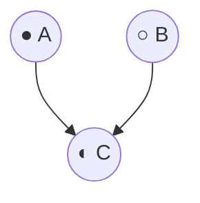

# I-gent Export: Markdown & Vim Serialization

Every I-gent view has a canonical markdown representation. This ensures the interface is **portable**—viewable in vim, printable to paper, editable in any text editor.

---

## Philosophy

> "The paper trail is the final arbiter. If it can't be written down, it doesn't exist."

Export is not a secondary feature—it is the **ground truth** of I-gent representation. The TUI renders markdown; markdown is primary.

### The Paper Metaphor

I-gents treat screen displays as *rendering* of underlying documents:

```
Markdown (source) → TUI (interactive rendering)
                  → Vim (editing rendering)
                  → Paper (archival rendering)
```

All three are views of the same specification.

---

## Export Format

### Document Structure

Every I-gent export is a valid markdown file:

```markdown
---
# YAML frontmatter
export_version: 1.0
exported_at: 2025-12-08T14:32:05Z
scale: page
agent_id: a-gent-001
---

# {Agent Name}

> "{Epigraph}"

## State
- **phase**: {symbol} {label}
- **time**: {elapsed}
- **joy**: {score}/10
- **ethics**: {score}/10

## Composition
​```mermaid
graph TD
    ...
​```

## Margin Notes
| Time | Source | Note |
|------|--------|------|
| ... | ... | ... |

## Actions
- [ ] observe
- [ ] invoke
- [ ] compose
- [ ] rest
```

---

## Scale-Specific Exports

### Glyph Export

Minimal export—just identity:

```markdown
---
export_version: 1.0
scale: glyph
agent_id: a-gent-001
---

● A-gent (active)
```

### Card Export

```markdown
---
export_version: 1.0
scale: card
agent_id: a-gent-001
---

# A-gent

- **phase**: ● active
- **time**: 00:14:32
- **joy**: 7/10
- **ethics**: 9/10
```

### Page Export

Full specification:

```markdown
---
export_version: 1.0
scale: page
agent_id: a-gent-001
exported_at: 2025-12-08T14:32:05Z
---

# A-gent

> "An A-gent seeks patterns in chaos, but knows when to stop looking."

## State

- **phase**: ● active
- **time**: 00:14:32
- **joy**: 7/10
- **ethics**: 9/10

## Composition

​```mermaid
graph TD
    A((● A)) -->|compose| C((◐ C))
    B((○ B)) -->|pending| C
    C --> K((● K))
​```

## Inputs

| Type | Schema |
|------|--------|
| input | `string` |
| config | `{threshold: number}` |

## Outputs

| Type | Schema |
|------|--------|
| result | `{patterns: string[], confidence: number}` |

## Configuration

```yaml
threshold: 0.75
max_patterns: 10
verbose: false
```

## Margin Notes

| Time | Source | Note |
|------|--------|------|
| 00:12:00 | system | phase transition: dormant → waking |
| 00:12:05 | ai | third attempt to compose with B |
| 00:13:30 | kent | holding tension—not forcing synthesis |
| 00:14:00 | ai | stable; composition graph coherent |

## History

| Time | Event | Details |
|------|-------|---------|
| 00:00:00 | created | from spec/a-gents/README.md |
| 00:05:00 | activated | user request |
| 00:10:00 | invoked | "analyze patterns" |
| 00:10:12 | completed | 3 patterns found |

## Actions

- [ ] observe
- [ ] invoke
- [ ] compose
- [ ] rest
```

### Garden Export

```markdown
---
export_version: 1.0
scale: garden
garden_id: research-session
exported_at: 2025-12-08T14:32:05Z
---

# research-session

**Session time**: 01:23:45
**Breath**: exhale

## Agents

| ID | Phase | Time | Joy | Ethics |
|----|-------|------|-----|--------|
| robin | ● active | 01:23:00 | 8/10 | 9/10 |
| analyze | ◐ waking | 00:05:00 | - | - |
| summarize | ● active | 00:45:00 | 7/10 | 8/10 |
| report | ● active | 00:30:00 | 6/10 | 9/10 |
| archive | ○ dormant | - | - | - |

## Topology

​```mermaid
graph TD
    robin((● robin)) --> analyze((◐ analyze))
    robin --> summarize((● summarize))
    analyze --> report((● report))
    summarize --> report
    report --> archive((○ archive))
​```

## Focus

Current: **robin**

## Margin Notes

| Time | Agent | Source | Note |
|------|-------|--------|------|
| 00:15:00 | robin | ai | beginning hypothesis exploration |
| 00:30:00 | report | system | first output generated |
| 01:00:00 | summarize | kent | good synthesis emerging |
```

### Library Export

```markdown
---
export_version: 1.0
scale: library
library_id: kgents-workspace
exported_at: 2025-12-08T14:32:05Z
---

# kgents-workspace

**System time**: 03:12:45:00 (3 days, 12 hours)
**Total gardens**: 3
**Orchestration**: converging

## Gardens

### garden:main

- **Agents**: ●A ○B ◐C ●K
- **Health**: 80%
- **Status**: active

### garden:experiment

- **Agents**: ◐A ●B ○C ◐K
- **Health**: 60%
- **Status**: active

### garden:production

- **Agents**: ●A ●B ●C ●K
- **Health**: 100%
- **Status**: stable

## Orchestration Graph

​```mermaid
graph TD
    main[garden:main] --> prod[garden:production]
    exp[garden:experiment] --> prod
    main -.->|fork| exp
​```

## Cross-Garden Events

| Time | From | To | Event |
|------|------|-----|-------|
| 2d ago | main | experiment | forked for testing |
| 1d ago | experiment | main | merged improvements |
| 12h ago | main | production | deployed v2.1 |
```

---

## Mermaid Integration

I-gents use Mermaid for diagrams in exports.

### Graph TD (Top-Down)

For composition graphs:



### Node Styling

Phase indicated in node label:
- `((● A))` — Active (filled circle shape)
- `((○ B))` — Dormant (empty circle shape)
- `((◐ C))` — Waking
- `((◑ D))` — Waning
- `((◌ E))` — Empty/Error

### Edge Styling

Connection types:
- `-->` — Active composition
- `-.->` — Pending/weak composition
- `==>` — Strong dependency

### Timeline (Gantt)

For temporal views:

```mermaid
gantt
    title Agent Timeline
    dateFormat HH:mm
    section A-gent
    dormant    :done, 00:00, 5m
    waking     :active, 00:05, 2m
    active     :crit, 00:07, 13m
```



---

## Vim Integration

Exports are designed for vim editing.

### Navigation

Use standard vim markdown navigation:
- `[[` / `]]` — Jump between headers
- `/` — Search
- `gd` — Go to definition (for Mermaid node IDs)

### Folding

Headers create natural fold points:
```vim
:set foldmethod=syntax
```

### Editing Margin Notes

Table rows are editable:
```markdown
| 00:14:30 | kent | adding new observation here |
```

### Syntax Highlighting

Standard markdown highlighting works. Mermaid blocks are recognized by most vim plugins.

### Recommended Plugins

- `vim-markdown` — Enhanced markdown support
- `vim-mermaid` — Mermaid syntax highlighting
- `vim-table-mode` — Table editing

---

## Import/Reimport

Exports can be reimported to update state.

### Reimport Semantics

| Field | Behavior |
|-------|----------|
| phase | Ignored (computed from actual state) |
| time | Ignored (computed from clock) |
| joy/ethics | Updated if changed |
| margin notes | Appended (new notes added) |
| actions (checkboxes) | Triggers action if checked |

### Conflict Resolution

If TUI state differs from imported markdown:
1. **Prompt**: "Markdown differs from current state. Apply changes?"
2. **Diff view**: Show what would change
3. **Options**: Apply / Merge / Discard

### Action Triggers

Checking an action box triggers it:

```markdown
## Actions

- [x] invoke  ← This triggers an invocation
- [ ] compose
```

---

## Print Export

For paper output, a simplified format:

### Print-Friendly Adjustments

- Remove interactive elements (action checkboxes become bullets)
- Expand abbreviations (● → [ACTIVE])
- Include timestamp and page numbers
- Monochrome-safe (no color-dependent meaning)

### Example Print Export

```markdown
# A-gent

Exported: 2025-12-08 14:32:05 UTC
Page 1 of 2

---

> "An A-gent seeks patterns in chaos, but knows when to stop looking."

## State

- Phase: [ACTIVE]
- Time: 00:14:32
- Joy: 7/10
- Ethics: 9/10

## Composition

    [ACTIVE] A
         \
          → [WAKING] C
         /
    [DORMANT] B

## Margin Notes

1. 00:12:00 [system] phase transition: dormant → waking
2. 00:12:05 [ai] third attempt to compose with B
3. 00:13:30 [kent] holding tension—not forcing synthesis
4. 00:14:00 [ai] stable; composition graph coherent

## Actions Available

- observe
- invoke
- compose
- rest

---

Page 2 of 2
```

---

## Format Versioning

### Version 1.0

The current specification (this document).

### Forward Compatibility

Future versions will:
- Add new optional fields (backward compatible)
- Deprecate fields with notice
- Use `export_version` to indicate format

### Backward Compatibility

Importers should:
- Ignore unknown fields
- Provide defaults for missing optional fields
- Warn on major version mismatch

---

## File Naming Conventions

### Agent Exports

```
{agent_id}.{scale}.md

Examples:
a-gent-001.page.md
a-gent-001.card.md
robin.page.md
```

### Garden Exports

```
{garden_id}.garden.md

Examples:
research-session.garden.md
main.garden.md
```

### Library Exports

```
{library_id}.library.md

Examples:
kgents-workspace.library.md
production.library.md
```

### Timestamped Exports

For archives:
```
{id}.{scale}.{timestamp}.md

Examples:
a-gent-001.page.2025-12-08T14-32-05Z.md
```

---

## Batch Export

Export multiple items at once:

### Directory Structure

```
exports/
├── 2025-12-08/
│   ├── library.md
│   ├── gardens/
│   │   ├── main.garden.md
│   │   └── experiment.garden.md
│   └── agents/
│       ├── a-gent-001.page.md
│       ├── robin.page.md
│       └── summarizer.page.md
```

### Index File

Batch exports include an index:

```markdown
# Export Index

Exported: 2025-12-08T14:32:05Z
Source: kgents-workspace

## Contents

### Library
- [kgents-workspace](library.md)

### Gardens
- [main](gardens/main.garden.md)
- [experiment](gardens/experiment.garden.md)

### Agents
- [A-gent](agents/a-gent-001.page.md)
- [robin](agents/robin.page.md)
- [summarizer](agents/summarizer.page.md)
```

---

## CLI Commands

Export via command line:

```bash
# Export single agent
kgents export a-gent-001 --scale page

# Export garden
kgents export --garden main

# Export full library
kgents export --library

# Export to specific file
kgents export robin --output robin-snapshot.md

# Batch export
kgents export --all --output-dir ./exports/
```

---

## Streaming Export

For long-running sessions, continuous export:

```bash
# Append margin notes as they occur
kgents export --stream --append-to session.md
```

Stream format:
```markdown
<!-- Stream marker: 2025-12-08T14:32:05Z -->

| 14:32:05 | robin | ai | new observation |

<!-- Stream marker: 2025-12-08T14:32:10Z -->

| 14:32:10 | robin | system | phase: active → waning |
```

---

## Security Considerations

### Sensitive Data

Before exporting, check for:
- API keys in configuration
- Personal data in margin notes
- Internal URLs in composition graphs

### Redaction

Export supports redaction:
```bash
kgents export --redact-config --redact-pattern "api_key:*"
```

### Audit Trail

Exports include audit metadata:
```yaml
---
exported_by: kent
export_reason: daily backup
export_policy: retain-30-days
---
```

---

## See Also

- [README.md](README.md) - I-gent philosophy
- [grammar.md](grammar.md) - Visual grammar (rendered from export)
- [scales.md](scales.md) - Scale-specific content
- [time.md](time.md) - Time representation in exports
- [../l-gents/lineage.md](../l-gents/lineage.md) - Export versioning and history
