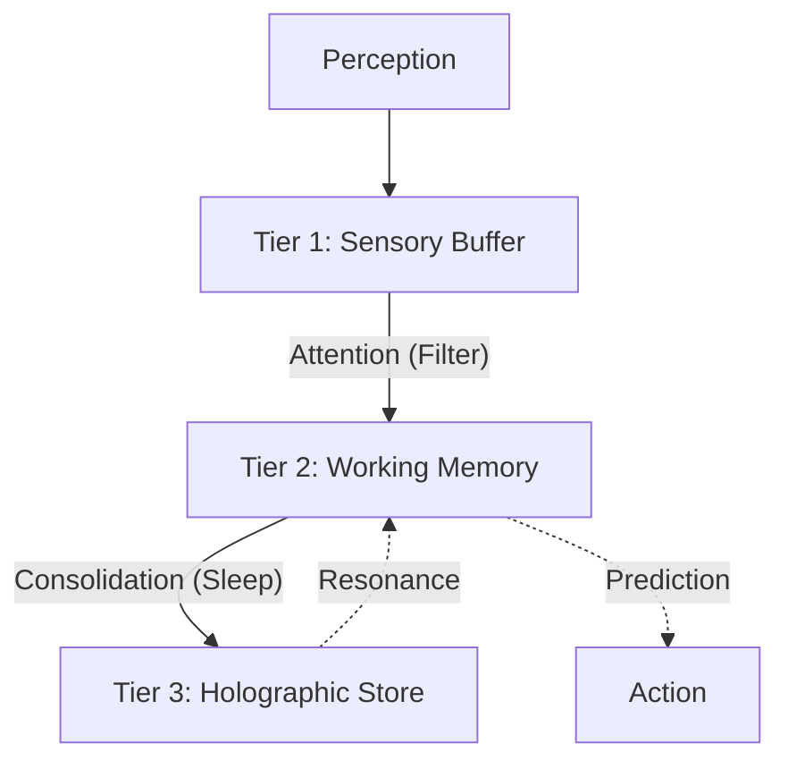

# Holographic Memory Architecture

> Memory is not a warehouse; it is a reconstruction engine.

---

## The Holographic Principle

Traditional memory systems are fragile—lose half the data, lose half the information. **Holographic memory** has a different property: cutting the memory in half doesn't lose half the data; it lowers the resolution of the *whole*.

### Key Properties

| Property | Traditional | Holographic |
|----------|-------------|-------------|
| **Graceful degradation** | Lose sector → lose data | Lose 50% → 50% fuzzier |
| **Content-addressable** | Key lookup | Similarity resonance |
| **Associative** | Explicit links | Implicit interference |
| **Generative** | Exact retrieval | Reconstruction |

---

## The Three-Tier Architecture

M-gents utilize a biological memory hierarchy:

```
┌─────────────────────────────────────────────────────────────────┐
│                   THREE-TIER HOLOGRAPHIC MEMORY                  │
├─────────────────────────────────────────────────────────────────┤
│                                                                  │
│  TIER 1: SENSORY BUFFER (Immediate)                             │
│  ┌─────────────────────────────────────────────────────────┐    │
│  │  • Last 10 seconds of raw input                          │    │
│  │  • High resolution, no compression                       │    │
│  │  • Volatile (D-gent: VolatileAgent)                      │    │
│  │  • Purpose: "What just happened?"                        │    │
│  └─────────────────────────────────────────────────────────┘    │
│                          ↓ attention filter                      │
│                                                                  │
│  TIER 2: WORKING MEMORY (Active)                                │
│  ┌─────────────────────────────────────────────────────────┐    │
│  │  • Current task context                                  │    │
│  │  • Medium resolution, some compression                   │    │
│  │  • Cached (D-gent: CachedAgent)                          │    │
│  │  • Purpose: "What am I doing?"                           │    │
│  │  • Capacity: ~7±2 chunks (Miller's Law)                  │    │
│  └─────────────────────────────────────────────────────────┘    │
│                          ↓ consolidation                         │
│                                                                  │
│  TIER 3: HOLOGRAPHIC LONG-TERM (Persistent)                     │
│  ┌─────────────────────────────────────────────────────────┐    │
│  │  • All experiences, compressed holographically           │    │
│  │  • Variable resolution (hot=high, cold=low)              │    │
│  │  • Persistent (D-gent: UnifiedMemory + VectorAgent)      │    │
│  │  • Purpose: "What do I know?"                            │    │
│  │  • Capacity: Theoretically unlimited (graceful degrade)  │    │
│  └─────────────────────────────────────────────────────────┘    │
│                                                                  │
└─────────────────────────────────────────────────────────────────┘
```

---

## Interference Pattern Model

Memory storage as superposition:

```
Memory₁ ───┐
           ├──► Interference Pattern ───► Reconstruction
Memory₂ ───┤         (superposition)         (from cue)
           │
Memory₃ ───┘    All memories exist in
               the same distributed space
```

### Mathematical Basis

**Encoding**: Given concept `c` and memory `m`:
```
e(c, m) = c ⊗ m  (tensor product / convolution)
```

**Storage**: The interference pattern `P` accumulates:
```
P = Σᵢ e(cᵢ, mᵢ)
```

**Retrieval**: Given cue `c`:
```
m̂ = P ⊗ c* = Σᵢ (cᵢ ⊗ mᵢ) ⊗ c*
```

If `c ≈ cⱼ`, then `m̂ ≈ mⱼ` (by orthogonality of other terms).

**Compression**: SVD preserves structure:
```
P' = SVDₖ(P)  where k < dim(P)
```

All memories preserved at lower resolution.

---

## Soft-Hologram Implementation

We simulate holographic physics using **Vector Superposition**:

1. **Superposition**: Don't just add rows—average vectors of similar concepts
   - Increases "magnitude" (confidence)
   - Blurs specific details (abstraction)

2. **The Blur**: Old memories re-embedded with lower precision (quantization)

3. **The Flashbulb**: High-emotion events "pinned" (prevented from compression)

---

## Memory Flow



### Key Operations

1. **Perceive**: Raw input → Sensory Buffer
2. **Attend**: Filter salient data → Working Memory
3. **Consolidate**: Compress + integrate → Holographic Store
4. **Recall**: Cue → Resonance → Reconstruction

---

## The Shift from RAG

| Traditional RAG | M-gent Holographic Memory |
| :--- | :--- |
| **Atomic**: Retrieves specific chunks | **Holistic**: Reconstructs composite views |
| **Fragile**: Missing key = missing data | **Resilient**: Graceful degradation of resolution |
| **Static**: Data sits until fetched | **Fluid**: Memories consolidate & evolve |
| **Discrete**: A vs. B | **Superposed**: A and B interfere to form C |

---

## The Cartography Layer

M-gents do not just store points; they understand the topology between them.

### From Points to Maps

Traditional M-gent operations:
- `store(key, value)` → Add a point
- `retrieve(key)` → Find nearest points

Cartographic M-gent operations:
- `map(context)` → Generate topology of nearby space
- `navigate(from, to)` → Find path via desire lines
- `inject(state, goal)` → Produce optimal context

### Key Abstractions

| Concept | Definition | Integration |
|:--------|:-----------|:------------|
| **Landmark** | A dense cluster of resonant memories | L-gent clustering |
| **Desire Line** | A transition probability derived from traces | N-gent SemanticTrace |
| **Void** | Sparse regions of latent space | Density analysis |
| **Horizon** | The boundary of progressive disclosure | B-gent budget |

### The Foveation Principle

Human vision is foveated: high resolution at the center, low at the periphery. M-gent context injection follows the same principle:

```
┌──────────────────────────────────────────────────────┐
│                    CONTEXT BUDGET                     │
│                                                       │
│     ┌─────────────────────────────────┐              │
│     │      BLUR ZONE (summaries)       │              │
│     │   ┌───────────────────────┐     │              │
│     │   │    FOCAL ZONE         │     │              │
│     │   │   (full detail)       │     │              │
│     │   │      ◉ YOU            │     │              │
│     │   │      ARE              │     │              │
│     │   │      HERE             │     │              │
│     │   └───────────────────────┘     │              │
│     │                                  │              │
│     └─────────────────────────────────┘              │
│                                                       │
│     ░░░░░░░░░░ HORIZON (fog) ░░░░░░░░░░              │
└──────────────────────────────────────────────────────┘
```

- **Focal zone**: Full memories, complete detail
- **Blur zone**: Landmark labels, summary sentences
- **Beyond horizon**: Invisible (not in context)

---

## See Also

- [primitives.md](primitives.md) - M-gent agent types
- [README.md](README.md) - M-gent philosophy
- [../d-gents/](../d-gents/) - D-gent storage layer
