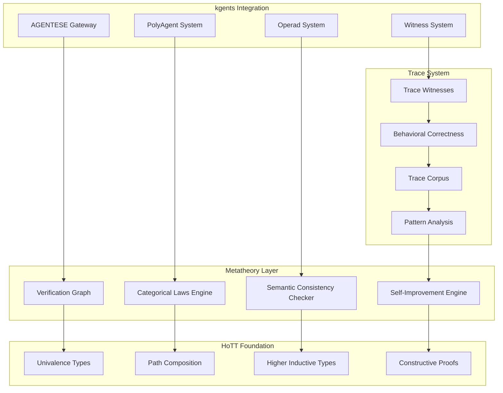

# Formal Verification Metatheory

> *"Reasoning about reasoning, verified."*

**Consolidated from**: metatheory.md (206 lines), metatheory-design.md (828 lines)
**Date**: 2025-12-24
**Target**: ~500 lines (down from 1,034)

---

## Part I: Purpose

The Formal Verification Metatheory system embodies the **Enormative Moment** — the transformative synthesis where Mind-Maps become topological spaces, specifications become compression morphisms, and implementations become constructive proofs. This enables kgents to become a **self-improving autopilot operating system** for massive long-lived multi-agent orchestration.

> *"The noun is a lie. There is only the rate of change."*

**Core Insight**: The system operates as a **reflective tower** where each level can critique, improve, and regenerate the level below it — from Kent's Intent (Level ∞) through HoTT foundations (Level 3) down to runtime traces (Level 0), and back up through pattern synthesis to refined principles.

### Glossary

- **Metatheory**: The formal system that reasons about and improves other formal systems (specs)
- **Mind_Map_Topology**: Topological space where nodes are open sets, edges are continuous maps, coherence satisfies sheaf gluing
- **Compression_Morphism**: Functor extracting essential decisions from higher to lower abstraction
- **Generative_Loop**: Mind-Map → Spec → Impl → Traces → Patterns → Refined Spec → Mind-Map
- **Reflective_Tower**: Hierarchy of abstraction levels (0-∞) where each level compresses the one below
- **HoTT_Foundation**: Homotopy Type Theory as unifying foundation where isomorphic structures are identical
- **Trace_Witness**: Constructive proof of behavioral correctness captured during execution
- **Alive_Workshop**: The aesthetic principle where formal verification feels organic, warm, breathing

---

## Part II: Requirements

### The Generative Loop

**When** Kent's Intent is captured in a mind-map, **Then** the Compression_Morphism extracts essential decisions into AGENTESE specifications. **When** specifications are approved, **Then** implementations preserve composition structure. **When** implementations execute, **Then** traces become constructive proofs. **When** traces accumulate, **Then** patterns suggest refinements. **When** spec drift is detected, **Then** mind-map updates are proposed.

**The Loop Must Close**: roundtrip Mind-Map → Spec → Impl → Mind-Map' preserves essential structure.

### The Reflective Tower

The system implements **7 levels of abstraction**, each verifying consistency with adjacent levels:

```
Level ∞: Principles & Values (Joy, Ethics, Composition)
    ↓ [Derivation Functor]
Level 3: Meta-Meta-Spec (HoTT/Topos Theory)
    ↓ [Category Functor]
Level 2: Meta-Spec (Category Theory, AGENTESE)
    ↓ [Specification Functor]
Level 1: Spec (Requirements, Design, Tasks)
    ↓ [Implementation Functor]
Level 0: Code (Python, TypeScript, Agents)
    ↓ [Execution Functor]
Level -1: Traces (Runtime Behavior, Witnesses)
    ↓ [Synthesis Functor]
Level -2: Patterns (Emergent Behaviors)
    ↓ [Feedback Functor]
Level ∞: Refined Principles (Self-Improvement)
```

### Mind-Map as Topological Space

Mind-maps are formal topological spaces where:
1. Nodes are **open sets**, edges are **continuous maps**
2. Clusters are **covers**, verified via **sheaf gluing condition**
3. Local perspective conflicts identified when sheaf condition fails
4. Supports import from Obsidian, Muse, other mind-mapping tools
5. Interactive visualization of topological structure

### HoTT as Unifying Foundation

Homotopy Type Theory provides:
1. **Univalence axiom**: Isomorphic specifications are identical
2. Agent types as **homotopy types** with natural equivalence
3. **Path composition** for composition law verification
4. **Higher inductive types** for agent structure definitions
5. **Constructive proofs** that are also programs (witnesses)
6. Bridge to Lean/Agda for formal theorem proving

### Category-Theoretic Law Verification

**Must verify**:
1. Composition associativity: `(f ∘ g) ∘ h = f ∘ (g ∘ h)`
2. Identity laws: `f ∘ id = f` and `id ∘ f = f`
3. Functor laws preserve composition and identity
4. Operad coherence conditions
5. Sheaf gluing properties

**On violation**: Generate counter-examples with remediation suggestions.

### Behavioral Correctness Through Trace Witnesses

1. Capture **Trace_Witnesses** as constructive proofs during execution
2. Verify traces satisfy specification properties
3. On violation, generate concrete counter-examples
4. Maintain corpus of verified traces for refinement
5. When patterns emerge, suggest specification improvements

### Self-Improvement Through Spec Critique

1. Identify patterns suggesting specification improvements
2. Generate formal proposals with justification
3. Verify proposals maintain categorical law compliance
4. Support automated A/B testing of specification variants
5. Auto-update specifications with proper versioning

### Semantic Consistency Verification

1. Verify semantic consistency across specification documents
2. Identify contradictory statements, suggest resolution
3. Verify backward compatibility, flag breaking changes
4. Cross-reference analysis between requirements, design, implementation
5. Suggest missing specifications or clarifications

### Autopilot Operating System Foundation

1. Continuously verify behavioral correctness of agent societies
2. Auto-trigger corrective actions on anomalies
3. Verify new agent compatibility before joining
4. Support dynamic reconfiguration with formal guarantees
5. Adapt orchestration strategies while preserving correctness

### Native kgents Integration

1. Integrate with `~/.kgents` directory structure
2. Auto-verify AGENTESE path categorical properties
3. Verify PolyAgent composition polynomial coherence
4. Integrate with existing witness and trace infrastructure
5. Trigger automatic re-verification on spec updates

### Alive Workshop Aesthetic

1. Use clear, sympathetic language with Studio Ghibli warmth
2. Provide constructive suggestions with examples, not cold jargon
3. Beautiful visualizations: graphs breathe, data flows like water, panels unfurl like leaves
4. Celebrate success with appropriate feedback
5. Progressive disclosure: simple results by default, detailed analysis on demand
6. Use Living Earth color palette (warm earth tones, living greens, Ghibli glow)

### Revolutionary Transformation Capability

1. Enable specification-driven agent generation
2. Auto-regenerate implementations on spec changes
3. Formal verification of emergent multi-agent behaviors
4. Provably correct composition at arbitrary scales
5. Auto-propose and verify evolutionary paths
6. **Generative Principle**: delete impl, regenerate from spec, result is isomorphic to original

### Graph-Based Specification Analysis

1. Construct **Verification_Graph** showing derivation paths from principles to implementation
2. Identify contradiction nodes, suggest resolution strategies
3. Flag orphaned implementations lacking principled derivation
4. Support multiple data types: agents, artifacts, narration, operational data
5. Interactive visualization of derivation structure with breathing animations

### Lean/Agda Bridge for Formal Proofs

1. Export Operad laws as Lean theorems
2. Use LLM to assist proof search in Lean/Agda
3. Import verification results back to Python
4. Support incremental proof development with partial verification
5. Provide diagnostics to guide proof repair on failure

---

## Part III: Architecture

### Core Components



### Integration with Existing kgents Infrastructure

1. **AGENTESE Protocol**: Auto-verify path definitions and aspect categories
2. **PolyAgent System**: Verify polynomial coherence and state transitions
3. **Witness System**: Enhanced with constructive proof capabilities
4. **Operad System**: Formal verification of composition grammar
5. **SheafTool System**: Verify local-to-global coherence

---

## Part IV: HoTT Foundation

### Univalence and Path Equality

In HoTT, **equality is a path type**. Two objects are equal if there exists a path (proof) between them.

```python
class HoTTContext:
    """Homotopy Type Theory context for formal verification."""

    async def construct_path(self, a: Any, b: Any) -> HoTTPath | None:
        """Construct a path (proof of equality) between a and b."""

        # Try univalence: if a ≅ b, then a ≡ b
        if await self._are_isomorphic(a, b):
            return await self._univalence_path(a, b)

        # Try path induction
        return await self._path_induction(a, b)

@dataclass(frozen=True)
class HoTTPath:
    """A path (proof of equality) in HoTT."""

    source: Any
    target: Any
    path_data: Any  # The actual proof term
    path_type: str  # "refl", "univalence", "induction", etc.
```

### Path Composition

Categorical law verification uses HoTT path composition:

```python
async def verify_composition_associativity(
    self,
    f: AgentMorphism,
    g: AgentMorphism,
    h: AgentMorphism
) -> VerificationResult:
    """Verify (f ∘ g) ∘ h ≡ f ∘ (g ∘ h) using path equality."""

    left_composition = await self._compose(await self._compose(f, g), h)
    right_composition = await self._compose(f, await self._compose(g, h))

    # In HoTT, equality is a path type
    path_proof = await self.hott.construct_path(left_composition, right_composition)

    if path_proof:
        return VerificationResult.success(
            law="composition_associativity",
            proof=path_proof,
            witness=CompositionWitness(f, g, h, path_proof)
        )
    else:
        counter_example = await self._generate_counter_example(f, g, h)
        return VerificationResult.failure(
            law="composition_associativity",
            counter_example=counter_example,
            suggestion=await self._suggest_fix(f, g, h, counter_example)
        )
```

---

## Part V: Implementation

### Verification Graph Engine

```python
@dataclass(frozen=True)
class VerificationGraph:
    """Graph representing logical derivations from principles to implementation."""

    nodes: frozenset[GraphNode]
    edges: frozenset[DerivationEdge]
    principles: frozenset[Principle]
    implementations: frozenset[Implementation]

    def derive_path(self, principle: Principle, impl: Implementation) -> DerivationPath | None:
        """Find derivation path from principle to implementation."""

    def find_contradictions(self) -> list[ContradictionNode]:
        """Identify nodes where principles conflict."""

    def find_orphans(self) -> list[OrphanNode]:
        """Find implementations lacking principled derivation."""

@dataclass(frozen=True)
class GraphNode:
    id: str
    level: int  # Position in reflective tower
    content: Any
    node_type: NodeType  # PRINCIPLE, SPECIFICATION, IMPLEMENTATION, TRACE, PATTERN
    metadata: dict[str, Any]

@dataclass(frozen=True)
class DerivationEdge:
    source: str  # Node ID
    target: str  # Node ID
    derivation_type: DerivationType
    justification: str
    confidence: float
```

### Trace Witness System

```python
class TraceWitnessSystem:
    """Captures and verifies trace witnesses as constructive proofs."""

    async def capture_witness(
        self,
        agent_path: str,
        input_data: Any,
        output_data: Any,
        execution_trace: ExecutionTrace
    ) -> TraceWitness:
        """Capture a trace witness as constructive proof."""

        witness = TraceWitness(
            agent_path=agent_path,
            input_data=input_data,
            output_data=output_data,
            trace=execution_trace,
            timestamp=datetime.utcnow(),
            proof_term=await self._construct_proof_term(execution_trace)
        )

        await self.trace_corpus.add_witness(witness)
        return witness

    async def verify_witness(
        self,
        witness: TraceWitness,
        specification: Specification
    ) -> WitnessVerification:
        """Verify that witness satisfies specification."""

        for property in specification.properties:
            if not await self._check_property(witness, property):
                return WitnessVerification.failure(
                    witness=witness,
                    violated_property=property,
                    counter_example=await self._extract_counter_example(witness, property)
                )

        return WitnessVerification.success(witness, specification)

    async def synthesize_patterns(self) -> list[BehaviorPattern]:
        """Analyze trace corpus to identify behavioral patterns."""

        patterns = []
        grouped_traces = self.trace_corpus.group_by_path()

        for path, traces in grouped_traces.items():
            invariants = await self._find_invariants(traces)
            compositions = await self._find_composition_patterns(traces)
            temporal = await self._find_temporal_patterns(traces)

            patterns.extend([
                BehaviorPattern("invariant", path, invariants),
                BehaviorPattern("composition", path, compositions),
                BehaviorPattern("temporal", path, temporal)
            ])

        return patterns
```

### Self-Improvement Engine

```python
class SelfImprovementEngine:
    """Analyzes patterns and proposes specification improvements."""

    async def analyze_improvement_opportunities(self) -> list[ImprovementProposal]:
        """Analyze system for improvement opportunities."""

        proposals = []

        # Find specification gaps
        gaps = await self._find_specification_gaps()
        proposals.extend(await self._propose_gap_fixes(gaps))

        # Find inefficient patterns
        inefficiencies = await self._find_inefficient_patterns()
        proposals.extend(await self._propose_efficiency_improvements(inefficiencies))

        # Find categorical law violations
        violations = await self._find_categorical_violations()
        proposals.extend(await self._propose_law_fixes(violations))

        # Find emergent behaviors that should be formalized
        emergent = await self._find_emergent_behaviors()
        proposals.extend(await self._propose_emergent_formalizations(emergent))

        return proposals

    async def validate_proposal(self, proposal: ImprovementProposal) -> ValidationResult:
        """Validate that a proposal maintains correctness."""

        # Create hypothetical system with proposal applied
        hypothetical_graph = await self._apply_proposal(self.graph, proposal)

        # Verify categorical laws still hold
        law_results = await self.categorical.verify_all_laws(hypothetical_graph)

        # Verify no new contradictions introduced
        contradictions = hypothetical_graph.find_contradictions()

        # Estimate impact on existing traces
        trace_impact = await self._estimate_trace_impact(proposal)

        if law_results.all_pass() and not contradictions and trace_impact.acceptable():
            return ValidationResult.approved(proposal, law_results, trace_impact)
        else:
            return ValidationResult.rejected(proposal, law_results, contradictions, trace_impact)
```

### Configuration Structure

```
~/.kgents/
├── verification/
│   ├── config.yaml              # Verification engine configuration
│   ├── principles.yaml          # System principles and priorities
│   ├── hott_context.json        # HoTT type definitions and universe levels
│   └── trace_corpus/            # Accumulated trace witnesses
├── graphs/
│   ├── current_graph.json       # Current verification graph
│   ├── graph_history/           # Historical graph states
│   └── visualizations/          # Generated graph visualizations
└── improvements/
    ├── proposals/               # Generated improvement proposals
    ├── validated/               # Validated improvements ready for application
    └── applied/                 # Applied improvements with results
```

---

## Part VI: Correctness Properties

*A property is a characteristic or behavior that should hold true across all valid executions of a system—essentially, a formal statement about what the system should do.*

### Graph & Derivation Properties

**Property 1: Graph Derivation Completeness**
*For any* specification with principled derivations, the verification graph contains a valid path from each principle to its corresponding implementation.

**Property 2: Contradiction Detection Soundness**
*For any* set of principles that logically conflict, the system identifies all contradiction nodes and provides resolution strategies.

**Property 3: Multi-Type Graph Support**
*For any* combination of agents, artifacts, narration, and operational data, the verification graph correctly represents and analyzes all data types.

### Categorical Law Properties

**Property 4: Categorical Composition Associativity**
*For any* three agent morphisms f, g, h, the composition `(f ∘ g) ∘ h = f ∘ (g ∘ h)` under HoTT path equality.

**Property 5: Categorical Identity Laws**
*For any* agent morphism f and identity morphism id, both `f ∘ id = f` and `id ∘ f = f` hold.

**Property 6: Functor Law Preservation**
*For any* agent functor F, it preserves both composition `F(g ∘ f) = F(g) ∘ F(f)` and identity `F(id) = id`.

**Property 7: Operad Coherence Verification**
*For any* operad specification, all coherence conditions are verified and violations generate counter-examples.

**Property 8: Sheaf Gluing Consistency**
*For any* sheaf tool, local-to-global gluing properties are verified with constructive proofs.

**Property 9: Counter-Example Generation**
*For any* categorical law violation, the system generates concrete counter-examples with remediation suggestions.

### Trace Witness Properties

**Property 10: Trace Witness Capture Completeness**
*For any* agent execution, a trace witness is captured as a constructive proof of the behavior.

**Property 11: Trace Specification Compliance**
*For any* trace witness and corresponding specification, the trace satisfies all specification properties or generates counter-examples.

**Property 12: Trace Corpus Evolution**
*For any* accumulated trace corpus, behavioral patterns are identified and specification improvements are suggested.

### Self-Improvement Properties

**Property 13: Self-Improvement Proposal Generation**
*For any* operational data accumulation, improvement patterns are identified and formal proposals generated with justification.

**Property 14: Improvement Categorical Compliance**
*For any* proposed specification change, categorical law compliance is verified before application.

**Property 15: Automated Specification Evolution**
*For any* validated improvement, specifications are automatically updated with proper versioning and A/B testing support.

### HoTT Foundation Properties

**Property 16: HoTT Univalence Foundation**
*For any* two specifications that are equivalent up to isomorphism, they are treated as identical under the univalence axiom.

**Property 17: Homotopy Type Representation**
*For any* agent type, it is represented as a homotopy type with natural equivalence structure.

**Property 18: HoTT Path Composition**
*For any* composition law verification, HoTT path composition is used with higher inductive types for agent structure definitions.

**Property 19: Constructive Proof Generation**
*For any* generated proof, it is constructive and also serves as a program (witness).

### Additional Critical Properties

**Property 20: Semantic Consistency Across Documents**
*For any* set of specification documents referencing the same concepts, semantic consistency is verified and conflicts identified.

**Property 21: Continuous Society Verification**
*For any* deployed agent society, behavioral correctness is continuously verified with automatic anomaly detection and correction.

**Property 22: Adaptive Orchestration Correctness**
*For any* system load change, orchestration strategies adapt while preserving correctness guarantees.

**Property 23: Sympathetic Error Communication**
*For any* verification error, the system provides clear, sympathetic language with constructive suggestions and examples.

**Property 24: Specification-Driven Agent Generation**
*For any* formal specification, agents are derivable and implementations automatically regenerated when specifications change.

**Property 25: Emergent Behavior Verification**
*For any* multi-agent system, emergent behaviors are formally verifiable with provably correct composition at arbitrary scales.

---

## Error Handling

The system employs a **sympathetic error model** that treats failures as learning opportunities:

```python
class VerificationErrorCategory(Enum):
    CATEGORICAL_LAW_VIOLATION = "categorical_law_violation"
    SEMANTIC_INCONSISTENCY = "semantic_inconsistency"
    DERIVATION_GAP = "derivation_gap"
    TRACE_SPECIFICATION_MISMATCH = "trace_specification_mismatch"
    IMPROVEMENT_VALIDATION_FAILURE = "improvement_validation_failure"
    HOTT_TYPE_ERROR = "hott_type_error"

@dataclass(frozen=True)
class VerificationError:
    category: VerificationErrorCategory
    message: str
    context: dict[str, Any]

    # Learning opportunities
    counter_example: Any | None
    suggested_fix: str | None
    educational_content: str | None

    # Recovery
    retry_strategy: str | None
    fallback_approach: str | None
```

### Sympathetic Error Messages

- **Categorical Law Violation**: "It looks like these agents don't compose quite right. Let me show you what's happening and suggest a fix."
- **Semantic Inconsistency**: "I found some concepts that mean different things in different places. Here's how we can align them."
- **Derivation Gap**: "This implementation seems to be floating without principled foundation. Let me suggest some connections."

---

## Testing Strategy

### Dual Testing Approach

**Unit Tests**: Specific examples, edge cases, integration points
- HoTT path construction examples
- Graph visualization generation
- kgents integration points
- Error message formatting

**Property-Based Tests**: Verify universal properties across all inputs (Hypothesis, minimum 100 iterations)
- All 25 correctness properties
- Categorical law verification across random agent compositions
- Trace witness generation for arbitrary executions
- Self-improvement proposal validation

**Custom Generators**:
- Agent morphisms and compositions
- HoTT types and paths
- Specification documents
- Trace witnesses
- Behavioral patterns

---

## Performance Considerations

- **Graph Analysis**: Incremental updates rather than full reconstruction
- **HoTT Path Construction**: Caching of computed paths and isomorphisms
- **Trace Corpus**: Efficient indexing and pattern matching
- **Property Verification**: Parallel execution of independent verifications

---

*"The noun is a lie. There is only the rate of change. And the most profound change is the rate at which we can verify and improve our own understanding."*
